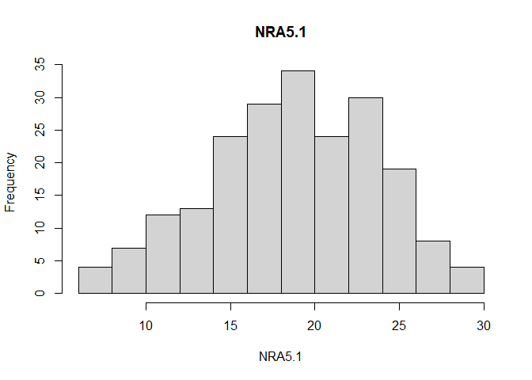
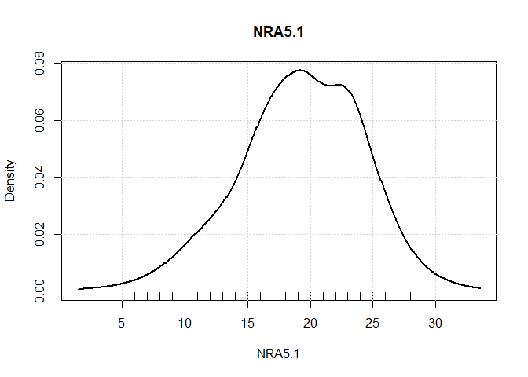
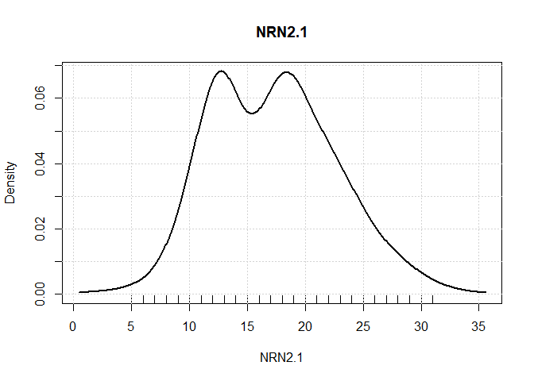
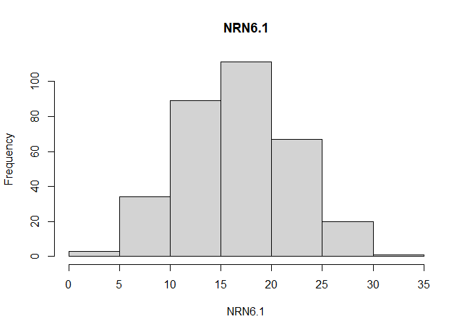
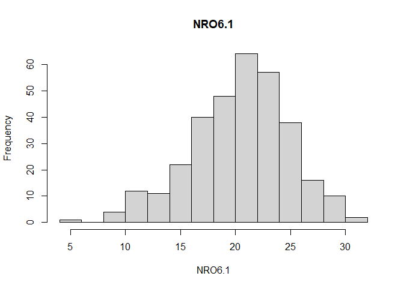

Prediction of Overall and Differential Treatment Response for Depression
using Personality Facets: Evaluating Multivariable Prediction Models
using Multi-Study Data
================
Michael Carnovale

This markdown file involves the following analyses steps: 
* Data cleaning 
* Descriptive statistics 
* Preliminary inferential statistics
  * Correlations between pre- and post-treatment depression scores 
  * Mean-level change in depression scores through treatment 
  * Self-report and clinician-rated agreement for pre- and post-treatment depression scores 
  * Correlations between personality facets and self-report/clinician-rated depression scores 
  * Correlation matrix of personality facets 
  * Regression models estimating treatment effects

**Note: for an easier navigation of the sections in this Markdown file,
please click the ‘bullet point’ button at the top-left of the viewer to
see a table of contents.**

# Load required packages

``` r
library(caret)   ## Package to help with machine learning functions
library(psych)   ## Descriptive stats and reliability statistics
library(dplyr)   ## Data management
library(car)     ## More data management
library(foreign) ## To import datasets
library(effsize) ## Effect sizes with CIs
library(visreg)  ## Visualization of regression models
library(jtools)  ## Various functions for regression models
library(glmnet)  ## Penalized regression package
library(summarytools)
library(boot)    ## Bootstrapping
```


    ##         boot summarytools       glmnet       Matrix       jtools       visreg 
    ##     "1.3-25"      "0.9.6"        "4.0"     "1.2-18"      "2.1.3"      "2.7.0" 
    ##      effsize      foreign          car      carData        dplyr        psych 
    ##      "0.8.0"     "0.8-80"      "3.0-8"      "3.0-4"      "1.0.6"  "1.9.12.31" 
    ##        caret      ggplot2      lattice 
    ##     "6.0-86"      "3.3.4"    "0.20-41"

# Data management

``` r
# Subset variables (FFM facets, time 1 and 2 HAMD/BDI-II sum scores, treatment group, age, sex)
neo.depr.1 = neo.depr.1[,c(252:281, 642, 647, 652, 653, 1, 7, 4, 5)]
neo.depr.2 = neo.depr.2[,c(9:38, 84, 90, 79, 82, 98, 7, 8)]

names(neo.depr.1)
```

    ##  [1] "NRN1.1"  "NRN2.1"  "NRN3.1"  "NRN4.1"  "NRN5.1"  "NRN6.1"  "NRE1.1" 
    ##  [8] "NRE2.1"  "NRE3.1"  "NRE4.1"  "NRE5.1"  "NRE6.1"  "NRO1.1"  "NRO2.1" 
    ## [15] "NRO3.1"  "NRO4.1"  "NRO5.1"  "NRO6.1"  "NRA1.1"  "NRA2.1"  "NRA3.1" 
    ## [22] "NRA4.1"  "NRA5.1"  "NRA6.1"  "NRC1.1"  "NRC2.1"  "NRC3.1"  "NRC4.1" 
    ## [29] "NRC5.1"  "NRC6.1"  "HD_17.1" "HD_17.2" "BDI2.1"  "BDI2.2"  "ccode"  
    ## [36] "txgrp"   "P121"    "age"

``` r
names(neo.depr.2)
```

    ##  [1] "NRN1.00"  "NRN2.00"  "NRN3.00"  "NRN4.00"  "NRN5.00"  "NRN6.00" 
    ##  [7] "NRE1.00"  "NRE2.00"  "NRE3.00"  "NRE4.00"  "NRE5.00"  "NRE6.00" 
    ## [13] "NRO1.00"  "NRO2.00"  "NRO3.00"  "NRO4.00"  "NRO5.00"  "NRO6.00" 
    ## [19] "NRA1.00"  "NRA2.00"  "NRA3.00"  "NRA4.00"  "NRA5.00"  "NRA6.00" 
    ## [25] "NRC1.00"  "NRC2.00"  "NRC3.00"  "NRC4.00"  "NRC5.00"  "NRC6.00" 
    ## [31] "HD_17.00" "HD_17.16" "bdi2.00"  "bdi2.16"  "txgrp"    "sex"     
    ## [37] "age"

``` r
# Cut down to participants in only the first three studies in the first dataset 
neo.depr.1 = subset(neo.depr.1, ccode == "UPC" | ccode == "NPL" | ccode == "OMHF")

# Renaming variables in second dataset to match the variable names in first dataset
depr.1.names = colnames(neo.depr.1[c(1:34, 36:38)])
names(neo.depr.2) = depr.1.names

# Adding in study code for second dataset 
neo.depr.2$ccode = "Quilty et al."
neo.depr.2$ccode = as.factor(neo.depr.2$ccode)

# Rescoring FFM facets in Quilty et al.
ffm.names = names(neo.depr.2[,c(1:30)])

better.ffm = neo.depr.2[,c(ffm.names)] - 4

neo.depr.2 = neo.depr.2[,c(31:38)]
neo.depr.2 = cbind(better.ffm, neo.depr.2)

# Combining both datasets into one for descriptive statistics
neo.depr.full = rbind(neo.depr.1, neo.depr.2)
neo.depr.full$txgrp = droplevels(neo.depr.full$txgrp)
neo.depr.full$ccode = droplevels(neo.depr.full$ccode)
neo.depr.1$txgrp = droplevels(neo.depr.1$txgrp)
neo.depr.2$txgrp = droplevels(neo.depr.2$txgrp)
neo.depr.1$ccode = droplevels(neo.depr.1$ccode)
neo.depr.2$ccode = droplevels(neo.depr.2$ccode)

# Taking out participants who did ipt
table(neo.depr.full$txgrp) # 45 participants
```

    ## 
    ## ipt cbt med 
    ##  45  94 265

``` r
neo.depr.full = subset(neo.depr.full, txgrp == "cbt" | txgrp == "med")
neo.depr.full$txgrp = droplevels(neo.depr.full$txgrp)


# Recoding sex variable
neo.depr.full$P121 = neo.depr.full$P121 - 1
neo.depr.full$P121 = as.factor(neo.depr.full$P121)


# Recoding treatment variable
neo.depr.full$txgrp = as.numeric(neo.depr.full$txgrp)
neo.depr.full$txgrp = neo.depr.full$txgrp - 1 # 0 = cbt, 1 = meds


# Renaming variables in full dataset
neo.depr.full = rename(neo.depr.full, sex = P121, hamd1 = HD_17.1, hamd2 = HD_17.2)
```

## Making separate datasets

``` r
neo.depr.cbt = subset(neo.depr.full, txgrp==0) # CBT participants only
neo.depr.med = subset(neo.depr.full, txgrp==1) # Med participants only

neo.depr.cbt.bdi = neo.depr.cbt[, c(1:30, 33:38)] # CBT participants with BDI-II data
neo.depr.med.bdi = neo.depr.med[, c(1:30, 33:38)] # Med participants with BDI-II data

neo.depr.cbt.hd = neo.depr.cbt[, c(1:32, 35:38)] # CBT participants with HAM-D data
neo.depr.med.hd = neo.depr.med[, c(1:32, 35:38)] # Med participants with HAM-D data

neo.depr.bdi = neo.depr.full[,c(1:30, 33:38)] # Participants with BDI-II data, across txgrp
neo.depr.hd = neo.depr.full[,c(1:32, 35:38)] # Participants with HAM-D data, across txgrp
```

## Handling missing data

``` r
# Checking for NAs
colSums(is.na(neo.depr.full)) # Number of NAs per variable in full data
```

    ## NRN1.1 NRN2.1 NRN3.1 NRN4.1 NRN5.1 NRN6.1 NRE1.1 NRE2.1 NRE3.1 NRE4.1 NRE5.1 
    ##      0      0      0      0      0      0      0      0      0      0      0 
    ## NRE6.1 NRO1.1 NRO2.1 NRO3.1 NRO4.1 NRO5.1 NRO6.1 NRA1.1 NRA2.1 NRA3.1 NRA4.1 
    ##      0      0      0      0      0      0      0      0      0      0      0 
    ## NRA5.1 NRA6.1 NRC1.1 NRC2.1 NRC3.1 NRC4.1 NRC5.1 NRC6.1  hamd1  hamd2 BDI2.1 
    ##      0      0      0      0      0      0      0      0      6     28    133 
    ## BDI2.2  ccode  txgrp    sex    age 
    ##    151      0      0      3      3

``` r
describeBy(neo.depr.full$BDI2.1, group = neo.depr.full$ccode) # First study didn't have any BDI-II data from participants
```

    ## Warning in min(x, na.rm = na.rm): no non-missing arguments to min; returning Inf

    ## Warning in max(x, na.rm = na.rm): no non-missing arguments to max; returning -
    ## Inf

    ## 
    ##  Descriptive statistics by group 
    ## group: UPC
    ##    vars n mean sd median trimmed mad min  max range skew kurtosis se
    ## X1    1 0  NaN NA     NA     NaN  NA Inf -Inf  -Inf   NA       NA NA
    ## ------------------------------------------------------------ 
    ## group: NPL
    ##    vars  n  mean    sd median trimmed mad min max range skew kurtosis   se
    ## X1    1 45 31.45 10.87     30   30.82 8.9  13  60    47 0.57     0.02 1.62
    ## ------------------------------------------------------------ 
    ## group: OMHF
    ##    vars  n  mean   sd median trimmed  mad min max range skew kurtosis   se
    ## X1    1 77 30.09 7.46  29.97   29.56 7.37  17  52    35 0.72     0.34 0.85
    ## ------------------------------------------------------------ 
    ## group: Quilty et al.
    ##    vars   n  mean   sd median trimmed  mad min max range  skew kurtosis   se
    ## X1    1 104 29.92 8.59   30.5   29.92 8.15   8  49    41 -0.06    -0.32 0.84

``` r
# Listwise deletion first
neo.depr.cbt.bdi = na.omit(neo.depr.cbt.bdi) 
neo.depr.cbt.hd = na.omit(neo.depr.cbt.hd)
neo.depr.med.bdi = na.omit(neo.depr.med.bdi)
neo.depr.med.hd = na.omit(neo.depr.med.hd)

neo.depr.bdi = na.omit(neo.depr.bdi)
neo.depr.hd = na.omit(neo.depr.hd)
```

# Descriptive stats

## Full sample before listwise deletion

``` r
## Sample size
table(neo.depr.full$ccode)
```

    ## 
    ##           UPC           NPL          OMHF Quilty et al. 
    ##           133            45            77           104

``` r
## Tx group, and tx by study
table(neo.depr.full$txgrp)
```

    ## 
    ##   0   1 
    ##  94 265

``` r
table(neo.depr.full$ccode, neo.depr.full$txgrp) 
```

    ##                
    ##                   0   1
    ##   UPC             0 133
    ##   NPL             0  45
    ##   OMHF           40  37
    ##   Quilty et al.  54  50

## Participants with full BDI-II data

``` r
## Sample size
nrow(neo.depr.bdi)
```

    ## [1] 208

``` r
## Study
table(neo.depr.bdi$ccode)
```

    ## 
    ##           UPC           NPL          OMHF Quilty et al. 
    ##             0            45            77            86

``` r
## Tx group
table(neo.depr.bdi$txgrp)
```

    ## 
    ##   0   1 
    ##  88 120

``` r
table(neo.depr.bdi$ccode, neo.depr.bdi$txgrp)
```

    ##                
    ##                  0  1
    ##   UPC            0  0
    ##   NPL            0 45
    ##   OMHF          40 37
    ##   Quilty et al. 48 38

``` r
## Sex
freq(neo.depr.bdi$sex)
```

    ## Frequencies  
    ## neo.depr.bdi$sex  
    ## Type: Factor  
    ## 
    ##               Freq   % Valid   % Valid Cum.   % Total   % Total Cum.
    ## ----------- ------ --------- -------------- --------- --------------
    ##           0     83     39.90          39.90     39.90          39.90
    ##           1    125     60.10         100.00     60.10         100.00
    ##        <NA>      0                               0.00         100.00
    ##       Total    208    100.00         100.00    100.00         100.00

``` r
## Age
describe(neo.depr.bdi$age, quant = c(.25, .75))
```

    ##   vars   n  mean    sd median trimmed   mad min max range skew kurtosis   se
    ## 1    1 208 37.31 11.42     36   36.77 13.34  18  65    47 0.37    -0.97 0.79
    ##   Q0.25 Q0.75
    ## 1 27.75 46.25

``` r
hist(neo.depr.bdi$age)
```

<!-- -->

``` r
densityPlot(neo.depr.bdi$age)
```

<!-- -->

``` r
describeBy(neo.depr.bdi$age, group = neo.depr.bdi$ccode, quant = c(.25, .75)) # By study
```

    ## 
    ##  Descriptive statistics by group 
    ## group: UPC
    ## NULL
    ## ------------------------------------------------------------ 
    ## group: NPL
    ##   vars  n  mean    sd median trimmed   mad min max range skew kurtosis   se
    ## 1    1 45 37.11 11.67     34   36.73 14.83  20  62    42 0.33    -1.18 1.74
    ##   Q0.25 Q0.75
    ## 1    28    48
    ## ------------------------------------------------------------ 
    ## group: OMHF
    ##   vars  n  mean    sd median trimmed   mad min max range skew kurtosis   se
    ## 1    1 77 41.51 11.74     40   41.46 14.83  21  65    44 0.02     -1.1 1.34
    ##   Q0.25 Q0.75
    ## 1    31    52
    ## ------------------------------------------------------------ 
    ## group: Quilty et al.
    ##   vars  n  mean   sd median trimmed mad min max range skew kurtosis   se Q0.25
    ## 1    1 86 33.65 9.72     30   33.01 8.9  18  59    41 0.59    -0.71 1.05    26
    ##   Q0.75
    ## 1    42

``` r
## FFM facets
describe(neo.depr.bdi[,c(1:30)], quant = c(.25, .75))
```

    ##        vars   n  mean   sd median trimmed  mad min max range  skew kurtosis
    ## NRN1.1    1 208 19.74 5.32   20.0   19.81 5.93   4  32    28 -0.14    -0.06
    ## NRN2.1    2 208 16.52 5.26   16.0   16.29 5.93   5  30    25  0.32    -0.36
    ## NRN3.1    3 208 24.08 4.35   24.5   24.24 3.71   9  32    23 -0.46     0.16
    ## NRN4.1    4 208 19.79 5.26   20.0   19.93 5.93   6  31    25 -0.25    -0.32
    ## NRN5.1    5 208 17.58 5.32   18.0   17.57 5.93   3  32    29  0.04    -0.18
    ## NRN6.1    6 208 15.70 4.84   16.0   15.65 4.45   3  27    24  0.06    -0.27
    ## NRE1.1    7 208 18.15 5.38   18.0   18.22 5.93   5  32    27 -0.12    -0.35
    ## NRE2.1    8 208 12.24 5.88   13.0   12.18 5.93   0  30    30  0.13    -0.10
    ## NRE3.1    9 208 11.43 5.46   11.0   11.29 5.93   0  24    24  0.22    -0.56
    ## NRE4.1   10 208 13.16 4.76   13.0   12.95 4.45   1  31    30  0.42     0.38
    ## NRE5.1   11 208 16.07 4.97   17.0   16.17 4.45   2  30    28 -0.17     0.16
    ## NRE6.1   12 208 11.75 5.72   12.0   11.62 5.93   0  26    26  0.16    -0.62
    ## NRO1.1   13 208 17.30 5.63   17.0   17.32 5.93   0  32    32 -0.07    -0.04
    ## NRO2.1   14 208 18.57 6.03   19.0   18.75 5.93   3  31    28 -0.32    -0.47
    ## NRO3.1   15 208 20.47 4.73   21.0   20.57 4.45   8  31    23 -0.20    -0.30
    ## NRO4.1   16 208 13.57 4.88   14.0   13.53 4.45   1  26    25  0.04    -0.36
    ## NRO5.1   17 208 19.90 5.76   20.0   20.02 5.93   7  31    24 -0.21    -0.69
    ## NRO6.1   18 208 20.15 4.65   20.5   20.33 5.19   5  30    25 -0.35    -0.18
    ## NRA1.1   19 208 15.88 5.30   16.0   15.89 5.93   2  31    29  0.00    -0.24
    ## NRA2.1   20 208 17.60 5.35   17.0   17.73 5.93   1  29    28 -0.27    -0.26
    ## NRA3.1   21 208 21.04 4.14   21.0   21.01 4.45  10  32    22  0.10    -0.44
    ## NRA4.1   22 208 14.96 5.14   15.0   14.90 4.45   3  30    27  0.12    -0.34
    ## NRA5.1   23 208 19.23 4.89   20.0   19.39 4.45   6  29    23 -0.29    -0.42
    ## NRA6.1   24 208 21.26 3.77   21.0   21.30 4.45  12  31    19 -0.01    -0.23
    ## NRC1.1   25 208 16.87 4.90   17.0   16.94 4.45   6  31    25 -0.07    -0.32
    ## NRC2.1   26 208 13.52 5.94   13.0   13.63 7.41   0  27    27 -0.15    -0.73
    ## NRC3.1   27 208 19.33 4.54   20.0   19.27 4.45   9  32    23  0.14    -0.13
    ## NRC4.1   28 208 13.74 5.70   14.0   13.65 5.93   1  31    30  0.19    -0.17
    ## NRC5.1   29 208 11.43 5.93   11.0   11.26 5.93   0  25    25  0.23    -0.77
    ## NRC6.1   30 208 15.69 5.42   16.0   15.64 4.45   3  30    27  0.09    -0.27
    ##          se Q0.25 Q0.75
    ## NRN1.1 0.37 16.00 23.00
    ## NRN2.1 0.37 12.75 20.00
    ## NRN3.1 0.30 21.75 27.00
    ## NRN4.1 0.36 16.00 24.00
    ## NRN5.1 0.37 14.00 21.00
    ## NRN6.1 0.34 12.75 19.00
    ## NRE1.1 0.37 14.00 22.00
    ## NRE2.1 0.41  8.00 16.00
    ## NRE3.1 0.38  8.00 15.00
    ## NRE4.1 0.33 10.00 16.00
    ## NRE5.1 0.34 13.00 19.00
    ## NRE6.1 0.40  7.00 16.00
    ## NRO1.1 0.39 13.00 21.00
    ## NRO2.1 0.42 15.00 22.25
    ## NRO3.1 0.33 17.00 23.25
    ## NRO4.1 0.34 10.00 17.00
    ## NRO5.1 0.40 16.00 24.00
    ## NRO6.1 0.32 17.00 24.00
    ## NRA1.1 0.37 12.00 20.00
    ## NRA2.1 0.37 14.00 22.00
    ## NRA3.1 0.29 18.00 24.00
    ## NRA4.1 0.36 12.00 18.25
    ## NRA5.1 0.34 16.00 23.00
    ## NRA6.1 0.26 19.00 24.00
    ## NRC1.1 0.34 13.00 20.00
    ## NRC2.1 0.41  9.00 18.00
    ## NRC3.1 0.31 16.00 22.00
    ## NRC4.1 0.40  9.75 17.00
    ## NRC5.1 0.41  7.00 16.00
    ## NRC6.1 0.38 13.00 19.00

``` r
describeBy(neo.depr.bdi[,c(1:30)], group = neo.depr.bdi$ccode, quant = c(.25, .75)) # By study
```

    ## 
    ##  Descriptive statistics by group 
    ## group: UPC
    ## NULL
    ## ------------------------------------------------------------ 
    ## group: NPL
    ##        vars  n  mean   sd median trimmed  mad min max range  skew kurtosis   se
    ## NRN1.1    1 45 21.58 4.90     22   21.49 5.93  13  31    18  0.10    -1.04 0.73
    ## NRN2.1    2 45 17.91 5.69     18   17.86 5.93   5  30    25 -0.05    -0.62 0.85
    ## NRN3.1    3 45 23.73 5.06     25   24.11 4.45   9  32    23 -0.78     0.13 0.75
    ## NRN4.1    4 45 19.51 5.51     21   19.78 4.45   6  29    23 -0.47    -0.41 0.82
    ## NRN5.1    5 45 18.07 5.84     17   17.89 5.93   6  31    25  0.30    -0.42 0.87
    ## NRN6.1    6 45 18.11 4.75     18   18.03 4.45  10  27    17  0.24    -0.87 0.71
    ## NRE1.1    7 45 17.89 6.19     18   17.92 7.41   5  30    25 -0.02    -0.85 0.92
    ## NRE2.1    8 45 12.58 5.60     13   12.51 4.45   0  25    25  0.07    -0.22 0.83
    ## NRE3.1    9 45 12.89 5.01     13   12.92 5.93   3  24    21  0.05    -0.75 0.75
    ## NRE4.1   10 45 13.73 5.31     13   13.30 4.45   4  31    27  0.85     1.11 0.79
    ## NRE5.1   11 45 14.76 4.87     15   14.89 4.45   5  23    18 -0.24    -0.75 0.73
    ## NRE6.1   12 45 12.76 6.30     12   12.62 5.93   0  26    26  0.23    -0.83 0.94
    ## NRO1.1   13 45 19.49 5.51     19   19.57 5.93   8  30    22  0.00    -0.85 0.82
    ## NRO2.1   14 45 19.64 5.98     20   19.76 5.93   7  31    24 -0.11    -0.64 0.89
    ## NRO3.1   15 45 20.80 5.55     22   21.00 4.45   8  31    23 -0.39    -0.31 0.83
    ## NRO4.1   16 45 14.69 4.25     14   14.38 2.97   5  26    21  0.68     0.58 0.63
    ## NRO5.1   17 45 20.33 6.83     21   20.46 8.90   8  31    23 -0.18    -1.24 1.02
    ## NRO6.1   18 45 21.87 4.20     22   21.97 4.45  14  29    15 -0.22    -0.98 0.63
    ## NRA1.1   19 45 17.27 5.87     18   17.38 5.93   3  31    28 -0.19    -0.31 0.87
    ## NRA2.1   20 45 20.27 3.39     20   20.24 4.45  14  28    14  0.14    -0.89 0.51
    ## NRA3.1   21 45 22.87 4.35     24   22.97 4.45  13  32    19 -0.23    -0.64 0.65
    ## NRA4.1   22 45 17.40 4.42     17   17.35 4.45   5  26    21 -0.05     0.07 0.66
    ## NRA5.1   23 45 21.40 4.33     22   21.65 4.45   8  29    21 -0.71     0.46 0.65
    ## NRA6.1   24 45 22.44 3.77     23   22.54 2.97  12  31    19 -0.26     0.40 0.56
    ## NRC1.1   25 45 18.91 5.64     19   19.14 4.45   6  31    25 -0.41    -0.01 0.84
    ## NRC2.1   26 45 16.84 4.78     18   17.05 2.97   5  26    21 -0.48    -0.15 0.71
    ## NRC3.1   27 45 19.18 4.67     20   19.24 5.93   9  29    20 -0.16    -0.80 0.70
    ## NRC4.1   28 45 14.76 6.96     15   14.57 7.41   3  31    28  0.13    -0.73 1.04
    ## NRC5.1   29 45 13.80 5.62     15   13.92 5.93   1  24    23 -0.25    -0.97 0.84
    ## NRC6.1   30 45 17.58 5.75     18   17.65 4.45   5  30    25 -0.06    -0.21 0.86
    ##        Q0.25 Q0.75
    ## NRN1.1    17    24
    ## NRN2.1    14    22
    ## NRN3.1    20    27
    ## NRN4.1    16    23
    ## NRN5.1    14    21
    ## NRN6.1    15    21
    ## NRE1.1    13    23
    ## NRE2.1     9    16
    ## NRE3.1     9    16
    ## NRE4.1    10    16
    ## NRE5.1    12    18
    ## NRE6.1     9    17
    ## NRO1.1    15    23
    ## NRO2.1    16    23
    ## NRO3.1    17    24
    ## NRO4.1    12    17
    ## NRO5.1    15    26
    ## NRO6.1    19    25
    ## NRA1.1    13    21
    ## NRA2.1    18    23
    ## NRA3.1    20    26
    ## NRA4.1    14    20
    ## NRA5.1    18    24
    ## NRA6.1    21    25
    ## NRC1.1    16    22
    ## NRC2.1    14    20
    ## NRC3.1    16    23
    ## NRC4.1    10    20
    ## NRC5.1     9    18
    ## NRC6.1    15    20
    ## ------------------------------------------------------------ 
    ## group: OMHF
    ##        vars  n  mean   sd median trimmed  mad min max range  skew kurtosis   se
    ## NRN1.1    1 77 20.94 5.43     20   20.98 5.93   7  32    25 -0.08    -0.45 0.62
    ## NRN2.1    2 77 17.05 5.33     17   16.78 5.93   6  29    23  0.34    -0.69 0.61
    ## NRN3.1    3 77 23.99 4.08     24   24.00 4.45  14  32    18 -0.05    -0.53 0.46
    ## NRN4.1    4 77 19.48 5.25     19   19.46 4.45   8  31    23  0.06    -0.39 0.60
    ## NRN5.1    5 77 18.74 5.18     19   18.73 5.93   8  32    24  0.05    -0.39 0.59
    ## NRN6.1    6 77 16.73 4.54     17   16.73 4.45   6  27    21 -0.01    -0.70 0.52
    ## NRE1.1    7 77 17.58 5.37     17   17.59 5.93   6  30    24 -0.04    -0.54 0.61
    ## NRE2.1    8 77 14.01 5.91     14   14.11 5.93   1  30    29 -0.04     0.17 0.67
    ## NRE3.1    9 77 12.82 5.41     13   12.67 5.93   4  24    20  0.22    -0.90 0.62
    ## NRE4.1   10 77 14.29 4.60     14   14.13 4.45   6  24    18  0.27    -0.84 0.52
    ## NRE5.1   11 77 15.35 4.91     16   15.37 4.45   3  27    24 -0.11    -0.29 0.56
    ## NRE6.1   12 77 13.05 5.61     13   13.05 5.93   1  25    24 -0.03    -0.73 0.64
    ## NRO1.1   13 77 18.45 5.36     19   18.35 5.93   6  32    26  0.07    -0.36 0.61
    ## NRO2.1   14 77 18.03 6.21     19   18.37 5.93   3  29    26 -0.56    -0.49 0.71
    ## NRO3.1   15 77 20.84 4.44     22   21.03 4.45   9  29    20 -0.41    -0.21 0.51
    ## NRO4.1   16 77 15.92 4.28     16   16.10 4.45   6  25    19 -0.28    -0.65 0.49
    ## NRO5.1   17 77 19.25 5.71     20   19.37 5.93   7  30    23 -0.28    -0.66 0.65
    ## NRO6.1   18 77 22.36 3.60     23   22.44 2.97  12  30    18 -0.31     0.06 0.41
    ## NRA1.1   19 77 17.01 5.51     17   17.19 5.93   2  29    27 -0.27    -0.18 0.63
    ## NRA2.1   20 77 20.18 4.42     21   20.24 5.93  11  29    18 -0.10    -0.84 0.50
    ## NRA3.1   21 77 21.58 3.69     22   21.59 4.45  13  31    18  0.08    -0.41 0.42
    ## NRA4.1   22 77 17.01 4.86     17   17.02 4.45   6  30    24  0.08    -0.54 0.55
    ## NRA5.1   23 77 20.55 3.76     20   20.43 4.45  12  29    17  0.25    -0.25 0.43
    ## NRA6.1   24 77 20.27 3.65     20   20.33 2.97  13  28    15 -0.07    -0.67 0.42
    ## NRC1.1   25 77 17.74 4.37     18   17.95 4.45   7  25    18 -0.45    -0.24 0.50
    ## NRC2.1   26 77 16.17 4.89     17   16.30 5.93   4  27    23 -0.25    -0.56 0.56
    ## NRC3.1   27 77 20.08 3.96     20   20.05 4.45  11  30    19  0.12    -0.43 0.45
    ## NRC4.1   28 77 14.94 4.67     15   14.97 4.45   4  29    25  0.04     0.31 0.53
    ## NRC5.1   29 77 13.73 5.59     13   13.62 5.93   3  25    22  0.18    -0.83 0.64
    ## NRC6.1   30 77 16.19 4.82     16   16.22 4.45   3  28    25 -0.05    -0.28 0.55
    ##        Q0.25 Q0.75
    ## NRN1.1    18    25
    ## NRN2.1    13    21
    ## NRN3.1    21    27
    ## NRN4.1    16    23
    ## NRN5.1    16    23
    ## NRN6.1    13    20
    ## NRE1.1    14    22
    ## NRE2.1    11    18
    ## NRE3.1     8    17
    ## NRE4.1    11    18
    ## NRE5.1    11    18
    ## NRE6.1     8    17
    ## NRO1.1    14    22
    ## NRO2.1    15    22
    ## NRO3.1    18    24
    ## NRO4.1    13    19
    ## NRO5.1    15    23
    ## NRO6.1    21    24
    ## NRA1.1    14    21
    ## NRA2.1    17    23
    ## NRA3.1    19    24
    ## NRA4.1    14    21
    ## NRA5.1    18    23
    ## NRA6.1    18    23
    ## NRC1.1    15    21
    ## NRC2.1    13    20
    ## NRC3.1    17    22
    ## NRC4.1    12    18
    ## NRC5.1    10    18
    ## NRC6.1    13    20
    ## ------------------------------------------------------------ 
    ## group: Quilty et al.
    ##        vars  n  mean   sd median trimmed  mad min max range  skew kurtosis   se
    ## NRN1.1    1 86 17.71 4.80   18.0   18.06 4.45   4  27    23 -0.61    -0.08 0.52
    ## NRN2.1    2 86 15.31 4.75   15.0   15.17 4.45   5  30    25  0.40     0.19 0.51
    ## NRN3.1    3 86 24.35 4.22   25.0   24.50 4.45  12  32    20 -0.43     0.13 0.46
    ## NRN4.1    4 86 20.22 5.18   21.0   20.41 5.93   6  30    24 -0.38    -0.29 0.56
    ## NRN5.1    5 86 16.29 4.94   17.0   16.39 4.45   3  25    22 -0.31    -0.49 0.53
    ## NRN6.1    6 86 13.52 4.26   14.0   13.60 4.45   3  23    20 -0.21    -0.42 0.46
    ## NRE1.1    7 86 18.80 4.90   19.0   18.93 4.45   6  32    26 -0.22     0.12 0.53
    ## NRE2.1    8 86 10.47 5.54   11.0   10.36 5.93   0  27    27  0.25    -0.19 0.60
    ## NRE3.1    9 86  9.42 5.14    9.0    9.24 4.45   0  22    22  0.35    -0.21 0.55
    ## NRE4.1   10 86 11.85 4.32   12.0   11.84 4.45   1  24    23  0.05    -0.08 0.47
    ## NRE5.1   11 86 17.41 4.81   17.5   17.46 3.71   2  30    28 -0.19     1.01 0.52
    ## NRE6.1   12 86 10.05 5.11   10.0   10.04 5.93   0  22    22  0.09    -0.80 0.55
    ## NRO1.1   13 86 15.13 5.22   15.0   15.33 4.45   0  26    26 -0.37     0.03 0.56
    ## NRO2.1   14 86 18.50 5.87   19.0   18.57 6.67   5  29    24 -0.15    -0.72 0.63
    ## NRO3.1   15 86 19.97 4.53   20.0   19.89 4.45  10  30    20  0.13    -0.56 0.49
    ## NRO4.1   16 86 10.87 4.38   11.0   10.84 5.93   1  25    24  0.21    -0.19 0.47
    ## NRO5.1   17 86 20.27 5.18   20.0   20.37 5.93   9  30    21 -0.17    -0.58 0.56
    ## NRO6.1   18 86 17.28 4.21   18.0   17.37 2.97   5  25    20 -0.31    -0.23 0.45
    ## NRA1.1   19 86 14.13 4.25   14.0   14.20 4.45   4  23    19 -0.12    -0.73 0.46
    ## NRA2.1   20 86 13.88 4.74   14.0   13.90 4.45   1  25    24 -0.03    -0.04 0.51
    ## NRA3.1   21 86 19.60 3.97   19.0   19.50 2.97  10  30    20  0.28    -0.16 0.43
    ## NRA4.1   22 86 11.84 4.03   12.0   11.90 4.45   3  21    18 -0.05    -0.67 0.44
    ## NRA5.1   23 86 16.92 5.15   16.0   16.89 5.93   6  28    22  0.08    -0.90 0.56
    ## NRA6.1   24 86 21.53 3.69   21.5   21.49 3.71  13  30    17  0.15    -0.31 0.40
    ## NRC1.1   25 86 15.02 4.30   15.0   14.99 4.45   6  27    21  0.16    -0.43 0.46
    ## NRC2.1   26 86  9.41 4.85    9.5    9.30 5.19   0  20    20  0.12    -0.72 0.52
    ## NRC3.1   27 86 18.74 4.89   19.0   18.53 4.45   9  32    23  0.42     0.18 0.53
    ## NRC4.1   28 86 12.14 5.49   12.0   11.90 5.93   1  26    25  0.34    -0.27 0.59
    ## NRC5.1   29 86  8.14 4.76    7.5    7.91 5.19   0  20    20  0.40    -0.62 0.51
    ## NRC6.1   30 86 14.26 5.42   14.0   14.10 5.93   4  29    25  0.27    -0.32 0.58
    ##        Q0.25 Q0.75
    ## NRN1.1 15.00 21.00
    ## NRN2.1 12.00 18.00
    ## NRN3.1 22.00 27.00
    ## NRN4.1 17.00 24.00
    ## NRN5.1 13.00 20.00
    ## NRN6.1 10.00 16.75
    ## NRE1.1 16.00 22.00
    ## NRE2.1  6.00 14.00
    ## NRE3.1  6.00 13.00
    ## NRE4.1  9.25 15.00
    ## NRE5.1 15.00 20.00
    ## NRE6.1  6.00 13.00
    ## NRO1.1 12.00 19.00
    ## NRO2.1 14.00 22.00
    ## NRO3.1 17.00 23.00
    ## NRO4.1  7.00 14.00
    ## NRO5.1 17.00 24.00
    ## NRO6.1 15.00 20.00
    ## NRA1.1 11.00 17.00
    ## NRA2.1 11.00 17.00
    ## NRA3.1 17.00 22.00
    ## NRA4.1  9.00 15.00
    ## NRA5.1 13.00 21.00
    ## NRA6.1 19.00 24.00
    ## NRC1.1 12.00 18.00
    ## NRC2.1  5.25 13.00
    ## NRC3.1 15.00 21.75
    ## NRC4.1  8.00 15.75
    ## NRC5.1  4.00 11.00
    ## NRC6.1 10.00 18.00

``` r
ffm.names = names(neo.depr.bdi[,c(1:30)])
for(i in 1:30){
  hist(neo.depr.bdi[,i], xlab = ffm.names[i], main = ffm.names[i])
  densityPlot(neo.depr.bdi[,i], xlab = ffm.names[i], main = ffm.names[i])
}
```

<!-- --><!-- --><!-- --><!-- --><!-- --><!-- --><!-- --><!-- --><!-- --><!-- --><!-- --><!-- --><!-- --><!-- --><!-- --><!-- --><!-- --><!-- --><!-- --><!-- --><!-- --><!-- --><!-- --><!-- --><!-- --><!-- --><!-- --><!-- --><!-- --><!-- --><!-- --><!-- --><!-- --><!-- --><!-- --><!-- --><!-- --><!-- --><!-- --><!-- --><!-- --><!-- --><!-- --><!-- --><!-- --><!-- --><!-- --><!-- --><!-- --><!-- --><!-- --><!-- --><!-- --><!-- --><!-- --><!-- --><!-- --><!-- --><!-- --><!-- -->

``` r
## Time 1 and Time 2 BDI-II
describe(neo.depr.bdi$BDI2.1, quant = c(.25, .75)) # Pre-tx
```

    ##   vars   n  mean   sd median trimmed  mad min max range skew kurtosis   se
    ## 1    1 208 30.21 8.51     30   29.87 7.41   8  60    52 0.44     0.59 0.59
    ##   Q0.25 Q0.75
    ## 1 24.75    35

``` r
hist(neo.depr.bdi$BDI2.1)
```

<!-- -->

``` r
densityPlot(neo.depr.bdi$BDI2.1)
```

<!-- -->

``` r
describe(neo.depr.bdi$BDI2.2, quant = c(.25, .75)) # Post-tx
```

    ##   vars   n  mean    sd median trimmed   mad min max range skew kurtosis   se
    ## 1    1 208 16.22 11.27     14   15.32 11.86   0  51    51 0.71    -0.07 0.78
    ##   Q0.25 Q0.75
    ## 1     7    23

``` r
hist(neo.depr.bdi$BDI2.2)
```

<!-- -->

``` r
densityPlot(neo.depr.bdi$BDI2.2)
```

<!-- -->

``` r
describeBy(neo.depr.bdi$BDI2.1, group = neo.depr.bdi$ccode, quant = c(.25, .75))
```

    ## 
    ##  Descriptive statistics by group 
    ## group: UPC
    ## NULL
    ## ------------------------------------------------------------ 
    ## group: NPL
    ##   vars  n  mean    sd median trimmed mad min max range skew kurtosis   se Q0.25
    ## 1    1 45 31.45 10.87     30   30.82 8.9  13  60    47 0.57     0.02 1.62    25
    ##   Q0.75
    ## 1    37
    ## ------------------------------------------------------------ 
    ## group: OMHF
    ##   vars  n  mean   sd median trimmed  mad min max range skew kurtosis   se Q0.25
    ## 1    1 77 30.09 7.46  29.97   29.56 7.37  17  52    35 0.72     0.34 0.85    25
    ##   Q0.75
    ## 1    35
    ## ------------------------------------------------------------ 
    ## group: Quilty et al.
    ##   vars  n  mean   sd median trimmed  mad min max range  skew kurtosis   se
    ## 1    1 86 29.66 8.03   30.5   29.79 8.15   8  48    40 -0.18    -0.18 0.87
    ##   Q0.25 Q0.75
    ## 1    24 34.75

``` r
describeBy(neo.depr.bdi$BDI2.2, group = neo.depr.bdi$ccode, quant = c(.25, .75))
```

    ## 
    ##  Descriptive statistics by group 
    ## group: UPC
    ## NULL
    ## ------------------------------------------------------------ 
    ## group: NPL
    ##   vars  n  mean    sd median trimmed   mad min max range skew kurtosis   se
    ## 1    1 45 19.87 12.88     17   18.87 13.34   1  51    50 0.65    -0.52 1.92
    ##   Q0.25 Q0.75
    ## 1    11    28
    ## ------------------------------------------------------------ 
    ## group: OMHF
    ##   vars  n  mean   sd median trimmed mad min max range skew kurtosis   se Q0.25
    ## 1    1 77 18.61 9.33     17   18.27 8.9   0  44    44  0.4    -0.59 1.06    12
    ##   Q0.75
    ## 1    26
    ## ------------------------------------------------------------ 
    ## group: Quilty et al.
    ##   vars  n  mean    sd median trimmed   mad min max range skew kurtosis   se
    ## 1    1 86 12.17 10.82     10    10.7 10.38   0  44    44 1.12     0.71 1.17
    ##   Q0.25 Q0.75
    ## 1  3.25 16.75

## Participants with full HAM-D data

``` r
## Sample size
nrow(neo.depr.hd)
```

    ## [1] 325

``` r
## Study
table(neo.depr.hd$ccode)
```

    ## 
    ##           UPC           NPL          OMHF Quilty et al. 
    ##           127            40            75            83

``` r
## Tx group
table(neo.depr.hd$txgrp)
```

    ## 
    ##   0   1 
    ##  84 241

``` r
table(neo.depr.hd$ccode, neo.depr.hd$txgrp)
```

    ##                
    ##                   0   1
    ##   UPC             0 127
    ##   NPL             0  40
    ##   OMHF           39  36
    ##   Quilty et al.  45  38

``` r
## Sex
freq(neo.depr.hd$sex)
```

    ## Frequencies  
    ## neo.depr.hd$sex  
    ## Type: Factor  
    ## 
    ##               Freq   % Valid   % Valid Cum.   % Total   % Total Cum.
    ## ----------- ------ --------- -------------- --------- --------------
    ##           0    127     39.08          39.08     39.08          39.08
    ##           1    198     60.92         100.00     60.92         100.00
    ##        <NA>      0                               0.00         100.00
    ##       Total    325    100.00         100.00    100.00         100.00

``` r
## Age
describe(neo.depr.hd$age, quant = c(.25, .75))
```

    ##   vars   n mean    sd median trimmed   mad min max range skew kurtosis   se
    ## 1    1 325 38.2 11.33     38   37.89 14.83  18  64    46 0.21    -1.06 0.63
    ##   Q0.25 Q0.75
    ## 1    28    48

``` r
hist(neo.depr.hd$age)
```

<!-- -->

``` r
densityPlot(neo.depr.hd$age)
```

<!-- -->

``` r
describeBy(neo.depr.hd$age, group = neo.depr.hd$ccode, quant = c(.25, .75))
```

    ## 
    ##  Descriptive statistics by group 
    ## group: UPC
    ##   vars   n  mean    sd median trimmed   mad min max range skew kurtosis   se
    ## 1    1 127 39.93 11.13     40   39.91 13.34  19  64    45 0.01       -1 0.99
    ##   Q0.25 Q0.75
    ## 1  30.5    49
    ## ------------------------------------------------------------ 
    ## group: NPL
    ##   vars  n mean    sd median trimmed   mad min max range skew kurtosis   se
    ## 1    1 40 36.6 11.75     34   36.12 14.83  20  62    42 0.35    -1.17 1.86
    ##   Q0.25 Q0.75
    ## 1    27    48
    ## ------------------------------------------------------------ 
    ## group: OMHF
    ##   vars  n  mean    sd median trimmed   mad min max range skew kurtosis   se
    ## 1    1 75 41.12 11.55     40   41.11 14.83  21  62    41 0.01    -1.15 1.33
    ##   Q0.25 Q0.75
    ## 1    31    52
    ## ------------------------------------------------------------ 
    ## group: Quilty et al.
    ##   vars  n mean   sd median trimmed mad min max range skew kurtosis   se Q0.25
    ## 1    1 83 33.7 9.81     30   33.04 8.9  18  59    41 0.59    -0.74 1.08    26
    ##   Q0.75
    ## 1    42

``` r
## FFM facets
describe(neo.depr.hd[,c(1:30)], quant = c(.25, .75))
```

    ##        vars   n  mean   sd median trimmed  mad min max range  skew kurtosis
    ## NRN1.1    1 325 20.76 5.31     21   20.87 5.93   4  32    28 -0.23    -0.19
    ## NRN2.1    2 325 17.22 5.39     17   17.05 5.93   5  31    26  0.23    -0.63
    ## NRN3.1    3 325 24.57 4.27     25   24.77 4.45   9  32    23 -0.49     0.07
    ## NRN4.1    4 325 20.36 5.38     21   20.45 5.93   6  32    26 -0.16    -0.56
    ## NRN5.1    5 325 18.14 5.25     18   18.14 4.45   3  32    29  0.03    -0.13
    ## NRN6.1    6 325 17.13 5.31     17   17.13 5.93   2  32    30 -0.03    -0.37
    ## NRE1.1    7 325 18.23 5.31     19   18.41 4.45   3  32    29 -0.30    -0.15
    ## NRE2.1    8 325 12.62 5.73     13   12.62 5.93   0  30    30  0.10    -0.02
    ## NRE3.1    9 325 11.94 5.45     12   11.81 5.93   0  27    27  0.20    -0.62
    ## NRE4.1   10 325 13.61 4.82     13   13.36 4.45   1  31    30  0.41    -0.02
    ## NRE5.1   11 325 15.48 5.00     16   15.54 4.45   2  30    28 -0.08    -0.15
    ## NRE6.1   12 325 11.91 5.77     12   11.82 5.93   0  26    26  0.13    -0.60
    ## NRO1.1   13 325 17.56 5.54     17   17.48 5.93   0  32    32  0.07    -0.10
    ## NRO2.1   14 325 18.50 5.89     19   18.73 5.93   2  32    30 -0.35    -0.26
    ## NRO3.1   15 325 20.86 4.79     21   20.98 4.45   8  32    24 -0.23    -0.16
    ## NRO4.1   16 325 14.12 4.71     14   14.18 4.45   1  26    25 -0.13    -0.34
    ## NRO5.1   17 325 19.20 6.03     20   19.31 5.93   5  32    27 -0.20    -0.82
    ## NRO6.1   18 325 20.91 4.49     21   21.09 4.45   5  31    26 -0.39     0.13
    ## NRA1.1   19 325 16.07 5.55     16   16.15 5.93   0  31    31 -0.10    -0.32
    ## NRA2.1   20 325 18.98 5.44     20   19.20 5.93   1  31    30 -0.38    -0.21
    ## NRA3.1   21 325 21.40 4.38     21   21.51 4.45   8  32    24 -0.22    -0.28
    ## NRA4.1   22 325 15.90 5.11     16   15.95 5.93   3  30    27 -0.09    -0.48
    ## NRA5.1   23 325 20.24 5.04     20   20.41 4.45   6  32    26 -0.30    -0.14
    ## NRA6.1   24 325 21.17 3.92     21   21.22 4.45  10  31    21 -0.10    -0.16
    ## NRC1.1   25 325 16.93 5.02     17   17.02 4.45   5  31    26 -0.13    -0.37
    ## NRC2.1   26 325 14.52 5.87     15   14.72 7.41   0  28    28 -0.23    -0.62
    ## NRC3.1   27 325 19.71 4.55     20   19.73 4.45   8  32    24 -0.02    -0.28
    ## NRC4.1   28 325 14.22 5.75     14   14.11 5.93   1  31    30  0.21    -0.20
    ## NRC5.1   29 325 12.35 6.04     12   12.27 5.93   0  28    28  0.12    -0.71
    ## NRC6.1   30 325 15.94 5.11     16   15.94 4.45   3  30    27  0.02    -0.28
    ##          se Q0.25 Q0.75
    ## NRN1.1 0.29    17    25
    ## NRN2.1 0.30    13    21
    ## NRN3.1 0.24    22    28
    ## NRN4.1 0.30    17    24
    ## NRN5.1 0.29    15    21
    ## NRN6.1 0.29    13    21
    ## NRE1.1 0.29    15    22
    ## NRE2.1 0.32     9    17
    ## NRE3.1 0.30     8    16
    ## NRE4.1 0.27    10    16
    ## NRE5.1 0.28    12    19
    ## NRE6.1 0.32     8    16
    ## NRO1.1 0.31    14    21
    ## NRO2.1 0.33    15    23
    ## NRO3.1 0.27    18    24
    ## NRO4.1 0.26    11    17
    ## NRO5.1 0.33    15    24
    ## NRO6.1 0.25    18    24
    ## NRA1.1 0.31    12    20
    ## NRA2.1 0.30    15    23
    ## NRA3.1 0.24    18    25
    ## NRA4.1 0.28    12    20
    ## NRA5.1 0.28    17    24
    ## NRA6.1 0.22    18    24
    ## NRC1.1 0.28    13    20
    ## NRC2.1 0.33    10    19
    ## NRC3.1 0.25    17    23
    ## NRC4.1 0.32    10    18
    ## NRC5.1 0.34     8    17
    ## NRC6.1 0.28    13    19

``` r
describeBy(neo.depr.hd[,c(1:30)], group = neo.depr.hd$ccode, quant = c(.25, .75))
```

    ## 
    ##  Descriptive statistics by group 
    ## group: UPC
    ##        vars   n  mean   sd median trimmed  mad min max range  skew kurtosis
    ## NRN1.1    1 127 22.47 4.83     22   22.61 5.93  11  32    21 -0.22    -0.61
    ## NRN2.1    2 127 18.46 5.37     19   18.39 7.41   8  31    23  0.10    -0.89
    ## NRN3.1    3 127 25.39 4.18     26   25.68 4.45   9  32    23 -0.81     0.98
    ## NRN4.1    4 127 21.33 5.45     22   21.47 5.93   9  32    23 -0.23    -0.79
    ## NRN5.1    5 127 19.09 5.04     19   19.08 4.45   6  32    26  0.03    -0.16
    ## NRN6.1    6 127 19.54 5.10     20   19.72 5.93   2  32    30 -0.37     0.06
    ## NRE1.1    7 127 18.08 5.37     19   18.46 5.93   3  29    26 -0.58    -0.07
    ## NRE2.1    8 127 13.22 5.46     13   13.22 5.93   0  29    29  0.07     0.14
    ## NRE3.1    9 127 12.59 5.34     12   12.46 5.93   2  27    25  0.22    -0.77
    ## NRE4.1   10 127 14.15 4.77     14   13.84 4.45   6  26    20  0.47    -0.64
    ## NRE5.1   11 127 14.57 4.91     15   14.58 4.45   4  26    22  0.01    -0.58
    ## NRE6.1   12 127 12.10 5.85     11   12.03 5.93   1  26    25  0.13    -0.61
    ## NRO1.1   13 127 18.15 5.53     18   17.92 5.93   7  32    25  0.38    -0.58
    ## NRO2.1   14 127 18.30 5.67     18   18.51 5.93   2  32    30 -0.35     0.04
    ## NRO3.1   15 127 21.28 4.89     21   21.39 4.45   8  32    24 -0.25    -0.05
    ## NRO4.1   16 127 14.94 4.20     15   15.06 4.45   3  24    21 -0.29    -0.21
    ## NRO5.1   17 127 18.03 6.25     19   18.08 7.41   5  32    27 -0.08    -1.04
    ## NRO6.1   18 127 22.16 3.86     22   22.17 4.45  11  31    20 -0.19     0.35
    ## NRA1.1   19 127 16.39 6.01     17   16.64 7.41   0  31    31 -0.28    -0.53
    ## NRA2.1   20 127 21.24 4.74     22   21.48 4.45   8  31    23 -0.51     0.00
    ## NRA3.1   21 127 21.79 4.64     23   22.08 4.45   8  31    23 -0.58     0.02
    ## NRA4.1   22 127 17.37 4.79     18   17.60 4.45   3  27    24 -0.49    -0.10
    ## NRA5.1   23 127 21.78 4.95     22   21.98 4.45   6  32    26 -0.47     0.48
    ## NRA6.1   24 127 21.15 4.14     21   21.21 4.45  10  30    20 -0.19    -0.15
    ## NRC1.1   25 127 16.93 5.22     17   17.05 5.93   5  28    23 -0.25    -0.43
    ## NRC2.1   26 127 16.09 5.30     16   16.26 5.93   3  28    25 -0.25    -0.53
    ## NRC3.1   27 127 20.25 4.55     20   20.42 4.45   8  30    22 -0.29    -0.48
    ## NRC4.1   28 127 14.90 5.82     14   14.77 5.93   3  29    26  0.23    -0.43
    ## NRC5.1   29 127 13.63 5.94     14   13.67 5.93   1  28    27  0.01    -0.56
    ## NRC6.1   30 127 16.34 4.70     16   16.44 4.45   4  26    22 -0.22    -0.41
    ##          se Q0.25 Q0.75
    ## NRN1.1 0.43  19.0  26.0
    ## NRN2.1 0.48  14.0  23.0
    ## NRN3.1 0.37  23.0  29.0
    ## NRN4.1 0.48  17.0  25.5
    ## NRN5.1 0.45  16.0  22.5
    ## NRN6.1 0.45  16.0  23.0
    ## NRE1.1 0.48  15.0  22.0
    ## NRE2.1 0.48   9.5  17.0
    ## NRE3.1 0.47   8.0  17.0
    ## NRE4.1 0.42  10.0  17.0
    ## NRE5.1 0.44  11.0  18.0
    ## NRE6.1 0.52   8.0  16.0
    ## NRO1.1 0.49  14.0  22.0
    ## NRO2.1 0.50  15.0  22.5
    ## NRO3.1 0.43  18.0  25.0
    ## NRO4.1 0.37  12.0  18.0
    ## NRO5.1 0.55  13.0  23.0
    ## NRO6.1 0.34  20.0  25.0
    ## NRA1.1 0.53  11.5  21.0
    ## NRA2.1 0.42  19.0  24.5
    ## NRA3.1 0.41  19.0  25.0
    ## NRA4.1 0.43  14.5  21.0
    ## NRA5.1 0.44  19.5  25.0
    ## NRA6.1 0.37  18.0  24.0
    ## NRC1.1 0.46  14.0  21.0
    ## NRC2.1 0.47  12.0  20.0
    ## NRC3.1 0.40  17.0  23.0
    ## NRC4.1 0.52  11.0  19.0
    ## NRC5.1 0.53  10.0  18.0
    ## NRC6.1 0.42  13.0  20.0
    ## ------------------------------------------------------------ 
    ## group: NPL
    ##        vars  n  mean   sd median trimmed  mad min max range  skew kurtosis   se
    ## NRN1.1    1 40 21.73 4.66   22.0   21.62 5.93  14  30    16  0.06    -1.12 0.74
    ## NRN2.1    2 40 18.10 5.85   18.5   18.09 5.93   5  30    25 -0.08    -0.69 0.93
    ## NRN3.1    3 40 23.75 4.69   25.0   23.94 5.19  12  32    20 -0.39    -0.70 0.74
    ## NRN4.1    4 40 19.50 5.26   20.0   19.66 5.19   7  29    22 -0.24    -0.66 0.83
    ## NRN5.1    5 40 17.95 5.92   17.0   17.72 5.93   6  31    25  0.32    -0.40 0.94
    ## NRN6.1    6 40 18.02 4.78   18.0   17.91 4.45  10  27    17  0.25    -0.91 0.76
    ## NRE1.1    7 40 18.12 6.21   19.0   18.19 7.41   5  30    25 -0.04    -0.80 0.98
    ## NRE2.1    8 40 12.32 5.57   12.5   12.28 5.19   0  25    25  0.02    -0.28 0.88
    ## NRE3.1    9 40 13.07 4.98   13.5   13.03 5.93   3  24    21  0.12    -0.85 0.79
    ## NRE4.1   10 40 14.05 5.53   14.0   13.62 4.45   4  31    27  0.71     0.74 0.87
    ## NRE5.1   11 40 14.75 4.89   15.0   14.84 4.45   5  23    18 -0.15    -0.81 0.77
    ## NRE6.1   12 40 12.82 6.27   12.0   12.66 6.67   0  26    26  0.22    -0.85 0.99
    ## NRO1.1   13 40 19.12 5.28   19.0   19.25 5.93   8  29    21 -0.08    -0.79 0.83
    ## NRO2.1   14 40 20.00 6.01   20.5   20.12 5.93   7  31    24 -0.14    -0.65 0.95
    ## NRO3.1   15 40 21.27 5.53   22.0   21.56 4.45   8  31    23 -0.49    -0.19 0.87
    ## NRO4.1   16 40 14.70 4.34   14.0   14.34 3.71   5  26    21  0.65     0.56 0.69
    ## NRO5.1   17 40 20.50 7.18   23.0   20.69 8.15   8  31    23 -0.23    -1.37 1.13
    ## NRO6.1   18 40 21.95 4.11   22.0   22.06 4.45  14  29    15 -0.14    -0.94 0.65
    ## NRA1.1   19 40 17.15 5.93   17.5   17.19 6.67   3  31    28 -0.08    -0.29 0.94
    ## NRA2.1   20 40 20.42 3.51   20.0   20.44 4.45  14  28    14  0.06    -1.00 0.56
    ## NRA3.1   21 40 23.35 4.33   24.0   23.56 4.45  13  32    19 -0.43    -0.38 0.68
    ## NRA4.1   22 40 17.45 4.63   17.0   17.41 4.45   5  26    21 -0.07    -0.14 0.73
    ## NRA5.1   23 40 21.52 4.49   22.5   21.84 5.19   8  29    21 -0.77     0.43 0.71
    ## NRA6.1   24 40 22.23 3.72   23.0   22.34 2.97  12  31    19 -0.31     0.62 0.59
    ## NRC1.1   25 40 19.35 5.55   20.0   19.56 4.45   6  31    25 -0.39    -0.06 0.88
    ## NRC2.1   26 40 17.27 4.71   18.0   17.53 2.97   5  26    21 -0.57     0.04 0.75
    ## NRC3.1   27 40 19.32 4.67   20.0   19.44 5.93   9  29    20 -0.19    -0.69 0.74
    ## NRC4.1   28 40 14.75 6.91   15.0   14.50 7.41   3  31    28  0.21    -0.58 1.09
    ## NRC5.1   29 40 14.25 5.63   15.5   14.50 5.19   1  24    23 -0.42    -0.75 0.89
    ## NRC6.1   30 40 17.98 5.69   18.0   18.03 4.45   5  30    25  0.00    -0.37 0.90
    ##        Q0.25 Q0.75
    ## NRN1.1 17.75 24.25
    ## NRN2.1 13.75 22.00
    ## NRN3.1 19.75 27.00
    ## NRN4.1 16.00 23.00
    ## NRN5.1 13.75 21.25
    ## NRN6.1 14.75 21.00
    ## NRE1.1 13.75 23.00
    ## NRE2.1  9.00 16.00
    ## NRE3.1  9.00 16.25
    ## NRE4.1 10.00 16.25
    ## NRE5.1 11.75 18.00
    ## NRE6.1  8.75 17.50
    ## NRO1.1 15.00 23.00
    ## NRO2.1 16.75 23.75
    ## NRO3.1 18.75 24.00
    ## NRO4.1 12.00 17.00
    ## NRO5.1 14.75 26.25
    ## NRO6.1 19.00 25.25
    ## NRA1.1 12.75 21.25
    ## NRA2.1 18.00 23.25
    ## NRA3.1 21.00 26.00
    ## NRA4.1 14.00 20.25
    ## NRA5.1 18.75 24.00
    ## NRA6.1 20.75 24.25
    ## NRC1.1 16.75 23.00
    ## NRC2.1 14.00 20.00
    ## NRC3.1 16.00 23.25
    ## NRC4.1 10.00 18.50
    ## NRC5.1 10.50 18.00
    ## NRC6.1 15.00 21.25
    ## ------------------------------------------------------------ 
    ## group: OMHF
    ##        vars  n  mean   sd median trimmed  mad min max range  skew kurtosis   se
    ## NRN1.1    1 75 20.83 5.44     20   20.85 5.93   7  32    25 -0.05    -0.44 0.63
    ## NRN2.1    2 75 17.07 5.38     17   16.79 5.93   6  29    23  0.34    -0.73 0.62
    ## NRN3.1    3 75 23.97 4.12     24   23.98 4.45  14  32    18 -0.04    -0.58 0.48
    ## NRN4.1    4 75 19.40 5.28     19   19.36 4.45   8  31    23  0.09    -0.39 0.61
    ## NRN5.1    5 75 18.83 5.08     19   18.79 5.93   8  32    24  0.12    -0.38 0.59
    ## NRN6.1    6 75 16.61 4.54     17   16.59 4.45   6  27    21  0.04    -0.67 0.52
    ## NRE1.1    7 75 17.79 5.29     17   17.84 5.93   6  30    24 -0.07    -0.43 0.61
    ## NRE2.1    8 75 13.97 5.98     14   14.07 5.93   1  30    29 -0.02     0.10 0.69
    ## NRE3.1    9 75 12.99 5.38     13   12.87 5.93   4  24    20  0.19    -0.88 0.62
    ## NRE4.1   10 75 14.45 4.54     14   14.31 4.45   6  24    18  0.26    -0.82 0.52
    ## NRE5.1   11 75 15.39 4.96     16   15.41 4.45   3  27    24 -0.13    -0.33 0.57
    ## NRE6.1   12 75 13.21 5.60     14   13.25 5.93   1  25    24 -0.08    -0.68 0.65
    ## NRO1.1   13 75 18.47 5.23     19   18.34 5.93   6  32    26  0.09    -0.24 0.60
    ## NRO2.1   14 75 18.20 6.20     19   18.59 5.93   3  29    26 -0.63    -0.37 0.72
    ## NRO3.1   15 75 20.97 4.43     22   21.20 4.45   9  29    20 -0.47    -0.09 0.51
    ## NRO4.1   16 75 16.07 4.23     16   16.28 4.45   6  25    19 -0.33    -0.55 0.49
    ## NRO5.1   17 75 19.43 5.66     20   19.59 5.93   7  30    23 -0.33    -0.58 0.65
    ## NRO6.1   18 75 22.35 3.63     23   22.43 2.97  12  30    18 -0.30     0.03 0.42
    ## NRA1.1   19 75 16.91 5.52     16   17.07 5.93   2  29    27 -0.25    -0.19 0.64
    ## NRA2.1   20 75 20.04 4.38     21   20.08 5.93  11  29    18 -0.06    -0.81 0.51
    ## NRA3.1   21 75 21.59 3.73     22   21.59 4.45  13  31    18  0.08    -0.46 0.43
    ## NRA4.1   22 75 16.89 4.83     16   16.90 5.93   6  30    24  0.09    -0.52 0.56
    ## NRA5.1   23 75 20.47 3.73     20   20.34 4.45  12  29    17  0.26    -0.20 0.43
    ## NRA6.1   24 75 20.25 3.70     20   20.31 2.97  13  28    15 -0.06    -0.72 0.43
    ## NRC1.1   25 75 17.77 4.42     18   18.00 4.45   7  25    18 -0.47    -0.28 0.51
    ## NRC2.1   26 75 16.13 4.94     17   16.26 5.93   4  27    23 -0.23    -0.62 0.57
    ## NRC3.1   27 75 19.97 3.95     20   19.92 4.45  11  30    19  0.16    -0.38 0.46
    ## NRC4.1   28 75 15.00 4.68     15   15.05 4.45   4  29    25  0.02     0.33 0.54
    ## NRC5.1   29 75 13.73 5.66     13   13.62 5.93   3  25    22  0.18    -0.88 0.65
    ## NRC6.1   30 75 16.03 4.75     16   16.05 4.45   3  28    25 -0.05    -0.22 0.55
    ##        Q0.25 Q0.75
    ## NRN1.1  17.5  25.0
    ## NRN2.1  13.0  21.0
    ## NRN3.1  21.0  27.0
    ## NRN4.1  16.0  23.0
    ## NRN5.1  16.0  23.0
    ## NRN6.1  13.0  20.0
    ## NRE1.1  14.5  22.0
    ## NRE2.1  11.0  18.0
    ## NRE3.1   8.5  17.0
    ## NRE4.1  11.0  18.0
    ## NRE5.1  11.0  18.0
    ## NRE6.1   8.0  17.0
    ## NRO1.1  14.0  22.0
    ## NRO2.1  15.0  22.5
    ## NRO3.1  18.0  24.0
    ## NRO4.1  13.5  19.0
    ## NRO5.1  16.0  23.0
    ## NRO6.1  20.5  24.0
    ## NRA1.1  13.5  21.0
    ## NRA2.1  16.5  23.0
    ## NRA3.1  19.0  24.5
    ## NRA4.1  14.0  21.0
    ## NRA5.1  18.0  23.0
    ## NRA6.1  18.0  23.5
    ## NRC1.1  15.5  21.0
    ## NRC2.1  13.0  20.0
    ## NRC3.1  17.0  22.0
    ## NRC4.1  12.0  18.0
    ## NRC5.1  10.0  18.0
    ## NRC6.1  13.0  19.0
    ## ------------------------------------------------------------ 
    ## group: Quilty et al.
    ##        vars  n  mean   sd median trimmed  mad min max range  skew kurtosis   se
    ## NRN1.1    1 83 17.61 4.85     18   17.96 4.45   4  27    23 -0.56    -0.17 0.53
    ## NRN2.1    2 83 15.04 4.50     15   14.96 4.45   5  28    23  0.23    -0.24 0.49
    ## NRN3.1    3 83 24.25 4.21     25   24.42 4.45  12  32    20 -0.46     0.10 0.46
    ## NRN4.1    4 83 20.14 5.25     20   20.33 5.93   6  30    24 -0.33    -0.37 0.58
    ## NRN5.1    5 83 16.14 4.92     17   16.25 4.45   3  25    22 -0.30    -0.54 0.54
    ## NRN6.1    6 83 13.47 4.32     14   13.54 4.45   3  23    20 -0.18    -0.50 0.47
    ## NRE1.1    7 83 18.90 4.75     19   18.99 4.45   8  32    24 -0.09     0.02 0.52
    ## NRE2.1    8 83 10.61 5.51     11   10.49 5.93   0  27    27  0.27    -0.23 0.61
    ## NRE3.1    9 83  9.43 5.20      9    9.25 4.45   0  22    22  0.35    -0.24 0.57
    ## NRE4.1   10 83 11.80 4.37     12   11.78 4.45   1  24    23  0.08    -0.10 0.48
    ## NRE5.1   11 83 17.31 4.82     17   17.36 2.97   2  30    28 -0.17     1.07 0.53
    ## NRE6.1   12 83 10.00 5.14     10    9.99 5.93   0  22    22  0.09    -0.81 0.56
    ## NRO1.1   13 83 15.07 5.25     15   15.27 4.45   0  26    26 -0.37     0.02 0.58
    ## NRO2.1   14 83 18.36 5.86     19   18.43 7.41   5  29    24 -0.16    -0.76 0.64
    ## NRO3.1   15 83 19.93 4.51     20   19.85 4.45  10  30    20  0.13    -0.51 0.49
    ## NRO4.1   16 83 10.81 4.43     11   10.76 5.93   1  25    24  0.24    -0.22 0.49
    ## NRO5.1   17 83 20.14 5.12     20   20.25 5.93   9  30    21 -0.20    -0.55 0.56
    ## NRO6.1   18 83 17.20 4.26     17   17.28 4.45   5  25    20 -0.26    -0.30 0.47
    ## NRA1.1   19 83 14.30 4.18     14   14.37 4.45   4  23    19 -0.11    -0.76 0.46
    ## NRA2.1   20 83 13.88 4.78     14   13.90 4.45   1  25    24 -0.04    -0.04 0.52
    ## NRA3.1   21 83 19.69 4.01     19   19.60 4.45  10  30    20  0.23    -0.22 0.44
    ## NRA4.1   22 83 12.00 3.97     12   12.06 4.45   4  21    17 -0.03    -0.73 0.44
    ## NRA5.1   23 83 17.05 5.09     16   17.03 5.93   6  28    22  0.08    -0.85 0.56
    ## NRA6.1   24 83 21.53 3.75     22   21.48 4.45  13  30    17  0.15    -0.40 0.41
    ## NRC1.1   25 83 15.01 4.26     15   14.96 4.45   6  27    21  0.21    -0.35 0.47
    ## NRC2.1   26 83  9.31 4.81      9    9.22 5.93   0  20    20  0.09    -0.73 0.53
    ## NRC3.1   27 83 18.82 4.91     19   18.61 4.45   9  32    23  0.41     0.20 0.54
    ## NRC4.1   28 83 12.20 5.54     12   11.97 5.93   1  26    25  0.32    -0.30 0.61
    ## NRC5.1   29 83  8.23 4.79      8    8.01 5.93   0  20    20  0.37    -0.66 0.53
    ## NRC6.1   30 83 14.25 5.31     14   14.06 5.93   5  29    24  0.33    -0.25 0.58
    ##        Q0.25 Q0.75
    ## NRN1.1  15.0  21.0
    ## NRN2.1  12.0  18.0
    ## NRN3.1  22.0  27.0
    ## NRN4.1  17.0  24.0
    ## NRN5.1  13.0  20.0
    ## NRN6.1  10.0  17.0
    ## NRE1.1  16.0  22.0
    ## NRE2.1   6.0  14.5
    ## NRE3.1   6.0  13.0
    ## NRE4.1   9.0  15.0
    ## NRE5.1  15.0  20.0
    ## NRE6.1   6.0  13.0
    ## NRO1.1  12.0  19.0
    ## NRO2.1  14.0  22.0
    ## NRO3.1  17.0  23.0
    ## NRO4.1   7.0  14.0
    ## NRO5.1  17.0  24.0
    ## NRO6.1  15.0  20.0
    ## NRA1.1  11.0  17.0
    ## NRA2.1  11.0  17.0
    ## NRA3.1  17.0  22.0
    ## NRA4.1   9.0  15.0
    ## NRA5.1  13.5  21.0
    ## NRA6.1  19.0  24.0
    ## NRC1.1  12.0  18.0
    ## NRC2.1   5.0  13.0
    ## NRC3.1  15.0  21.5
    ## NRC4.1   8.0  16.0
    ## NRC5.1   4.0  11.5
    ## NRC6.1  10.0  18.0

``` r
for(i in 1:30){
  hist(neo.depr.hd[,i], xlab = ffm.names[i], main = ffm.names[i])
  densityPlot(neo.depr.hd[,i], xlab = ffm.names[i], main = ffm.names[i])
}
```

<!-- --><!-- --><!-- --><!-- --><!-- --><!-- --><!-- --><!-- --><!-- --><!-- --><!-- --><!-- --><!-- --><!-- --><!-- --><!-- --><!-- --><!-- --><!-- --><!-- --><!-- --><!-- --><!-- --><!-- --><!-- --><!-- --><!-- --><!-- --><!-- --><!-- --><!-- --><!-- --><!-- --><!-- --><!-- --><!-- --><!-- --><!-- --><!-- --><!-- --><!-- --><!-- --><!-- --><!-- --><!-- --><!-- --><!-- --><!-- --><!-- --><!-- --><!-- --><!-- --><!-- --><!-- --><!-- --><!-- --><!-- --><!-- --><!-- --><!-- -->

``` r
## Time 1 and Time 2 HAM-D
describe(neo.depr.hd$hamd1, quant = c(.25, .75)) # Pre-tx
```

    ##   vars   n  mean   sd median trimmed  mad min max range skew kurtosis   se
    ## 1    1 325 19.32 5.07     19   19.26 4.45   4  40    36 0.27     0.79 0.28
    ##   Q0.25 Q0.75
    ## 1    16    23

``` r
hist(neo.depr.hd$hamd1)
```

<!-- -->

``` r
densityPlot(neo.depr.hd$hamd1)
```

<!-- -->

``` r
describe(neo.depr.hd$hamd2, quant = c(.25, .75)) # Post-tx
```

    ##   vars   n mean   sd median trimmed  mad min max range skew kurtosis   se Q0.25
    ## 1    1 325 8.82 7.36      7    8.12 7.41   0  33    33 0.72    -0.34 0.41     3
    ##   Q0.75
    ## 1    14

``` r
hist(neo.depr.hd$hamd2)
```

<!-- -->

``` r
densityPlot(neo.depr.hd$hamd2)
```

<!-- -->

``` r
describeBy(neo.depr.hd$hamd1, group = neo.depr.hd$ccode, quant = c(.25, .75))
```

    ## 
    ##  Descriptive statistics by group 
    ## group: UPC
    ##   vars   n  mean   sd median trimmed  mad min max range skew kurtosis  se Q0.25
    ## 1    1 127 21.98 4.51     21   21.62 4.45  14  40    26  0.9      1.3 0.4    18
    ##   Q0.75
    ## 1    25
    ## ------------------------------------------------------------ 
    ## group: NPL
    ##   vars  n  mean   sd median trimmed  mad min max range skew kurtosis   se Q0.25
    ## 1    1 40 19.48 5.33   19.5   19.41 5.19   9  31    22 0.13    -0.95 0.84    16
    ##   Q0.75
    ## 1 24.25
    ## ------------------------------------------------------------ 
    ## group: OMHF
    ##   vars  n  mean   sd median trimmed  mad min max range skew kurtosis   se Q0.25
    ## 1    1 75 17.79 3.26     17   17.61 2.97  10  26    16 0.45     -0.1 0.38    16
    ##   Q0.75
    ## 1    19
    ## ------------------------------------------------------------ 
    ## group: Quilty et al.
    ##   vars  n  mean   sd median trimmed  mad min max range  skew kurtosis   se
    ## 1    1 83 16.58 5.15     16   16.61 4.45   4  28    24 -0.07    -0.37 0.57
    ##   Q0.25 Q0.75
    ## 1  13.5    20

``` r
describeBy(neo.depr.hd$hamd2, group = neo.depr.hd$ccode, quant = c(.25, .75))
```

    ## 
    ##  Descriptive statistics by group 
    ## group: UPC
    ##   vars   n  mean   sd median trimmed   mad min max range skew kurtosis   se
    ## 1    1 127 10.09 8.25      9    9.41 10.38   0  33    33 0.58    -0.65 0.73
    ##   Q0.25 Q0.75
    ## 1     3    17
    ## ------------------------------------------------------------ 
    ## group: NPL
    ##   vars  n  mean   sd median trimmed mad min max range skew kurtosis   se Q0.25
    ## 1    1 40 12.07 7.23   12.5   11.88 8.9   0  25    25 0.07    -1.17 1.14     5
    ##   Q0.75
    ## 1    18
    ## ------------------------------------------------------------ 
    ## group: OMHF
    ##   vars  n mean  sd median trimmed  mad min max range skew kurtosis   se Q0.25
    ## 1    1 75 5.91 5.7      4    5.16 4.45   0  22    22 1.05     0.19 0.66     1
    ##   Q0.75
    ## 1     9
    ## ------------------------------------------------------------ 
    ## group: Quilty et al.
    ##   vars  n mean   sd median trimmed  mad min max range skew kurtosis   se Q0.25
    ## 1    1 83 7.93 6.26      7    7.36 7.41   0  26    26 0.68    -0.31 0.69     3
    ##   Q0.75
    ## 1    12

# Preliminary inferential statistics

## Functions

``` r
# Functions for bootstrapping Spearman's correlations for CIs

spearman.boot = function(data, indices, x, y){
  d = data[indices, ]
  cor = cor.test(d[,c(x)], d[,c(y)], method = "spearman")$estimate # Getting the r estimate
  return(cor)
}

spearman = function(data, x, y, xlab, ylab){
  cor.out = cor.test(data[,c(x)], data[,c(y)], method = "spearman")
  print(cor.out) # Print the actual esimate and p-value
  set.seed(2020)
  boot = boot(data, statistic = spearman.boot, R = 1000, x = x, y = y) %>% boot.ci(type = "bca")
  print(boot) # Print BCa CIs
  scatter.hist(data[,c(x)], data[,c(y)], method = "spearman", ellipse = F, ab = T, xlab = xlab, ylab = ylab)
}

# Function for paired t-tests and bootstrapping CIs for cohen's dz

cohen.dz.boot = function(data, indices, t1, t2, n){
  d = data[indices, ]
  statistic = t.test(d[,c(t1)], d[,c(t2)])$statistic
  dz = sqrt(statistic/n) # Cohen's dz 
  return(dz)
}

paired = function(data, t1, t2, n){
  test = t.test(data[,c(t1)], data[,c(t2)], paired = T)
  print(test)
  statistic = test$statistic
  dz = sqrt(statistic/n)
  print(dz)
  set.seed(2020)
  boot = boot(data, statistic = cohen.dz.boot, R = 1000, t1 = t1, t2 = t2, n = n) %>% boot.ci(type = "bca")
  print(boot) # Bootstrapped cohen's dz
}
```

## Rank-order correlation between pre- and post-tx depression scores

``` r
spearman(neo.depr.bdi, x = "BDI2.1", y = "BDI2.2", xlab = "BDI-II Pre", ylab = "BDI-II Post")
```

    ## 
    ##  Spearman's rank correlation rho
    ## 
    ## data:  data[, c(x)] and data[, c(y)]
    ## S = 1066885, p-value = 2.357e-05
    ## alternative hypothesis: true rho is not equal to 0
    ## sample estimates:
    ##      rho 
    ## 0.288641 
    ## 
    ## BOOTSTRAP CONFIDENCE INTERVAL CALCULATIONS
    ## Based on 1000 bootstrap replicates
    ## 
    ## CALL : 
    ## boot.ci(boot.out = ., type = "bca")
    ## 
    ## Intervals : 
    ## Level       BCa          
    ## 95%   ( 0.1492,  0.4154 )  
    ## Calculations and Intervals on Original Scale

<!-- -->

``` r
spearman(neo.depr.full, x = "hamd1", y = "hamd2", xlab = "HAM-D Pre", ylab = "HAM-D Post")
```

    ## 
    ##  Spearman's rank correlation rho
    ## 
    ## data:  data[, c(x)] and data[, c(y)]
    ## S = 4292431, p-value = 6.818e-07
    ## alternative hypothesis: true rho is not equal to 0
    ## sample estimates:
    ##       rho 
    ## 0.2701442 
    ## 
    ## BOOTSTRAP CONFIDENCE INTERVAL CALCULATIONS
    ## Based on 1000 bootstrap replicates
    ## 
    ## CALL : 
    ## boot.ci(boot.out = ., type = "bca")
    ## 
    ## Intervals : 
    ## Level       BCa          
    ## 95%   ( 0.1702,  0.3803 )  
    ## Calculations and Intervals on Original Scale

<!-- -->

## Mean-level change in depression scores from pre-tx to post-tx

``` r
# Across treatment type
paired(data = neo.depr.bdi, t1 = "BDI2.1", t2 = "BDI2.2", n = 208)
```

    ## 
    ##  Paired t-test
    ## 
    ## data:  data[, c(t1)] and data[, c(t2)]
    ## t = 18.072, df = 207, p-value < 2.2e-16
    ## alternative hypothesis: true difference in means is not equal to 0
    ## 95 percent confidence interval:
    ##  12.45949 15.51086
    ## sample estimates:
    ## mean of the differences 
    ##                13.98518 
    ## 
    ##         t 
    ## 0.2947589 
    ## BOOTSTRAP CONFIDENCE INTERVAL CALCULATIONS
    ## Based on 1000 bootstrap replicates
    ## 
    ## CALL : 
    ## boot.ci(boot.out = ., type = "bca")
    ## 
    ## Intervals : 
    ## Level       BCa          
    ## 95%   ( 0.2407,  0.2799 )  
    ## Calculations and Intervals on Original Scale

``` r
paired(data = neo.depr.hd, t1 = "hamd1", t2 = "hamd2", n = 325)
```

    ## 
    ##  Paired t-test
    ## 
    ## data:  data[, c(t1)] and data[, c(t2)]
    ## t = 25.691, df = 324, p-value < 2.2e-16
    ## alternative hypothesis: true difference in means is not equal to 0
    ## 95 percent confidence interval:
    ##   9.70020 11.30903
    ## sample estimates:
    ## mean of the differences 
    ##                10.50462 
    ## 
    ##         t 
    ## 0.2811545 
    ## BOOTSTRAP CONFIDENCE INTERVAL CALCULATIONS
    ## Based on 1000 bootstrap replicates
    ## 
    ## CALL : 
    ## boot.ci(boot.out = ., type = "bca")
    ## 
    ## Intervals : 
    ## Level       BCa          
    ## 95%   ( 0.2401,  0.2699 )  
    ## Calculations and Intervals on Original Scale

## Self-interview agreement between pre- and post-tx depression scores

``` r
spearman(neo.depr.full, x = "BDI2.1", y = "hamd1", xlab = "BDI-II Pre", ylab = "HAM-D Pre")
```

    ## 
    ##  Spearman's rank correlation rho
    ## 
    ## data:  data[, c(x)] and data[, c(y)]
    ## S = 1007256, p-value = 2.456e-12
    ## alternative hypothesis: true rho is not equal to 0
    ## sample estimates:
    ##       rho 
    ## 0.4476159 
    ## 
    ## BOOTSTRAP CONFIDENCE INTERVAL CALCULATIONS
    ## Based on 1000 bootstrap replicates
    ## 
    ## CALL : 
    ## boot.ci(boot.out = ., type = "bca")
    ## 
    ## Intervals : 
    ## Level       BCa          
    ## 95%   ( 0.3228,  0.5538 )  
    ## Calculations and Intervals on Original Scale

<!-- -->

``` r
spearman(neo.depr.full, x = "BDI2.2", y = "hamd2", xlab = "BDI-II Post", ylab = "HAM-D Post")
```

    ## 
    ##  Spearman's rank correlation rho
    ## 
    ## data:  data[, c(x)] and data[, c(y)]
    ## S = 633014, p-value = 4.649e-15
    ## alternative hypothesis: true rho is not equal to 0
    ## sample estimates:
    ##      rho 
    ## 0.518034 
    ## 
    ## BOOTSTRAP CONFIDENCE INTERVAL CALCULATIONS
    ## Based on 1000 bootstrap replicates
    ## 
    ## CALL : 
    ## boot.ci(boot.out = ., type = "bca")
    ## 
    ## Intervals : 
    ## Level       BCa          
    ## 95%   ( 0.3781,  0.6113 )  
    ## Calculations and Intervals on Original Scale

<!-- -->

``` r
spearman(neo.depr.full, x = "BDI2.1", y = "hamd2", xlab = "BDI-II Pre", ylab = "HAM-D Post")
```

    ## 
    ##  Spearman's rank correlation rho
    ## 
    ## data:  data[, c(x)] and data[, c(y)]
    ## S = 1160838, p-value = 0.1023
    ## alternative hypothesis: true rho is not equal to 0
    ## sample estimates:
    ##       rho 
    ## 0.1161577 
    ## 
    ## BOOTSTRAP CONFIDENCE INTERVAL CALCULATIONS
    ## Based on 1000 bootstrap replicates
    ## 
    ## CALL : 
    ## boot.ci(boot.out = ., type = "bca")
    ## 
    ## Intervals : 
    ## Level       BCa          
    ## 95%   (-0.0256,  0.2614 )  
    ## Calculations and Intervals on Original Scale

<!-- -->

``` r
spearman(neo.depr.full, x = "hamd1", y = "BDI2.2", xlab = "HAM-D Pre", ylab = "BDI-II Post")
```

    ## 
    ##  Spearman's rank correlation rho
    ## 
    ## data:  data[, c(x)] and data[, c(y)]
    ## S = 1033932, p-value = 9.847e-05
    ## alternative hypothesis: true rho is not equal to 0
    ## sample estimates:
    ##       rho 
    ## 0.2692597 
    ## 
    ## BOOTSTRAP CONFIDENCE INTERVAL CALCULATIONS
    ## Based on 1000 bootstrap replicates
    ## 
    ## CALL : 
    ## boot.ci(boot.out = ., type = "bca")
    ## 
    ## Intervals : 
    ## Level       BCa          
    ## 95%   ( 0.1216,  0.3899 )  
    ## Calculations and Intervals on Original Scale

<!-- -->

## Correlations between each FFM facet and BDI-II scores

``` r
print(corr.test(neo.depr.bdi[,c(1:30)], neo.depr.bdi[,c(31:32)], method = "spearman", ci = T, alpha = .001), short = F)
```

    ## Call:corr.test(x = neo.depr.bdi[, c(1:30)], y = neo.depr.bdi[, c(31:32)], 
    ##     method = "spearman", alpha = 0.001, ci = T)
    ## Correlation matrix 
    ##        BDI2.1 BDI2.2
    ## NRN1.1   0.31   0.28
    ## NRN2.1   0.21   0.11
    ## NRN3.1   0.41   0.14
    ## NRN4.1   0.32   0.12
    ## NRN5.1   0.28   0.05
    ## NRN6.1   0.30   0.18
    ## NRE1.1  -0.09  -0.15
    ## NRE2.1  -0.05   0.04
    ## NRE3.1  -0.10   0.16
    ## NRE4.1  -0.10   0.03
    ## NRE5.1  -0.05  -0.07
    ## NRE6.1  -0.25  -0.06
    ## NRO1.1   0.09   0.11
    ## NRO2.1  -0.04   0.01
    ## NRO3.1   0.05   0.06
    ## NRO4.1  -0.09   0.02
    ## NRO5.1  -0.03  -0.04
    ## NRO6.1  -0.02   0.12
    ## NRA1.1  -0.18   0.01
    ## NRA2.1   0.00   0.20
    ## NRA3.1   0.05   0.13
    ## NRA4.1  -0.09   0.16
    ## NRA5.1   0.15   0.20
    ## NRA6.1   0.01  -0.05
    ## NRC1.1  -0.19   0.16
    ## NRC2.1  -0.08   0.22
    ## NRC3.1  -0.14   0.07
    ## NRC4.1  -0.19   0.12
    ## NRC5.1  -0.22   0.07
    ## NRC6.1  -0.26   0.10
    ## Sample Size 
    ## [1] 208
    ## Probability values  adjusted for multiple tests. 
    ##        BDI2.1 BDI2.2
    ## NRN1.1   0.00   0.00
    ## NRN2.1   0.14   1.00
    ## NRN3.1   0.00   1.00
    ## NRN4.1   0.00   1.00
    ## NRN5.1   0.00   1.00
    ## NRN6.1   0.00   0.36
    ## NRE1.1   1.00   1.00
    ## NRE2.1   1.00   1.00
    ## NRE3.1   1.00   0.74
    ## NRE4.1   1.00   1.00
    ## NRE5.1   1.00   1.00
    ## NRE6.1   0.01   1.00
    ## NRO1.1   1.00   1.00
    ## NRO2.1   1.00   1.00
    ## NRO3.1   1.00   1.00
    ## NRO4.1   1.00   1.00
    ## NRO5.1   1.00   1.00
    ## NRO6.1   1.00   1.00
    ## NRA1.1   0.43   1.00
    ## NRA2.1   1.00   0.21
    ## NRA3.1   1.00   1.00
    ## NRA4.1   1.00   0.76
    ## NRA5.1   1.00   0.16
    ## NRA6.1   1.00   1.00
    ## NRC1.1   0.24   0.74
    ## NRC2.1   1.00   0.08
    ## NRC3.1   1.00   1.00
    ## NRC4.1   0.28   1.00
    ## NRC5.1   0.07   1.00
    ## NRC6.1   0.01   1.00
    ## 
    ##  Confidence intervals based upon normal theory.  To get bootstrapped values, try cor.ci
    ##              raw.lower raw.r raw.upper raw.p lower.adj upper.adj
    ## NRN1.-BDI2.1      0.09  0.31      0.50  0.00      0.02      0.55
    ## NRN2.-BDI2.1     -0.02  0.21      0.41  0.14     -0.09      0.47
    ## NRN3.-BDI2.1      0.21  0.41      0.58  0.00      0.14      0.63
    ## NRN4.-BDI2.1      0.10  0.32      0.51  0.00      0.03      0.56
    ## NRN5.-BDI2.1      0.06  0.28      0.48  0.00     -0.01      0.53
    ## NRN6.-BDI2.1      0.08  0.30      0.49  0.00      0.01      0.55
    ## NRE1.-BDI2.1     -0.31 -0.09      0.13  1.00     -0.37      0.19
    ## NRE2.-BDI2.1     -0.27 -0.05      0.18  1.00     -0.31      0.22
    ## NRE3.-BDI2.1     -0.32 -0.10      0.13  1.00     -0.37      0.18
    ## NRE4.-BDI2.1     -0.32 -0.10      0.13  1.00     -0.37      0.19
    ## NRE5.-BDI2.1     -0.27 -0.05      0.18  1.00     -0.32      0.22
    ## NRE6.-BDI2.1     -0.45 -0.25     -0.03  0.01     -0.51      0.04
    ## NRO1.-BDI2.1     -0.14  0.09      0.31  1.00     -0.20      0.36
    ## NRO2.-BDI2.1     -0.26 -0.04      0.19  1.00     -0.30      0.23
    ## NRO3.-BDI2.1     -0.18  0.05      0.27  1.00     -0.22      0.32
    ## NRO4.-BDI2.1     -0.31 -0.09      0.14  1.00     -0.36      0.20
    ## NRO5.-BDI2.1     -0.26 -0.03      0.19  1.00     -0.29      0.23
    ## NRO6.-BDI2.1     -0.25 -0.02      0.20  1.00     -0.28      0.23
    ## NRA1.-BDI2.1     -0.39 -0.18      0.05  0.43     -0.44      0.11
    ## NRA2.-BDI2.1     -0.22  0.00      0.23  1.00     -0.22      0.23
    ## NRA3.-BDI2.1     -0.18  0.05      0.27  1.00     -0.22      0.31
    ## NRA4.-BDI2.1     -0.31 -0.09      0.14  1.00     -0.36      0.20
    ## NRA5.-BDI2.1     -0.08  0.15      0.36  1.00     -0.15      0.41
    ## NRA6.-BDI2.1     -0.22  0.01      0.24  1.00     -0.24      0.26
    ## NRC1.-BDI2.1     -0.40 -0.19      0.03  0.24     -0.46      0.10
    ## NRC2.-BDI2.1     -0.30 -0.08      0.15  1.00     -0.35      0.20
    ## NRC3.-BDI2.1     -0.35 -0.14      0.09  1.00     -0.41      0.15
    ## NRC4.-BDI2.1     -0.40 -0.19      0.04  0.28     -0.45      0.10
    ## NRC5.-BDI2.1     -0.43 -0.22      0.00  0.07     -0.48      0.07
    ## NRC6.-BDI2.1     -0.46 -0.26     -0.04  0.01     -0.52      0.03
    ## NRN1.-BDI2.2      0.05  0.28      0.47  0.00     -0.02      0.52
    ## NRN2.-BDI2.2     -0.12  0.11      0.33  1.00     -0.18      0.38
    ## NRN3.-BDI2.2     -0.09  0.14      0.35  1.00     -0.15      0.41
    ## NRN4.-BDI2.2     -0.11  0.12      0.34  1.00     -0.17      0.39
    ## NRN5.-BDI2.2     -0.18  0.05      0.27  1.00     -0.22      0.32
    ## NRN6.-BDI2.2     -0.04  0.18      0.39  0.36     -0.11      0.45
    ## NRE1.-BDI2.2     -0.36 -0.15      0.08  1.00     -0.42      0.14
    ## NRE2.-BDI2.2     -0.19  0.04      0.27  1.00     -0.23      0.30
    ## NRE3.-BDI2.2     -0.06  0.16      0.38  0.74     -0.13      0.43
    ## NRE4.-BDI2.2     -0.20  0.03      0.26  1.00     -0.23      0.29
    ## NRE5.-BDI2.2     -0.29 -0.07      0.16  1.00     -0.34      0.21
    ## NRE6.-BDI2.2     -0.28 -0.06      0.17  1.00     -0.33      0.22
    ## NRO1.-BDI2.2     -0.12  0.11      0.33  1.00     -0.18      0.38
    ## NRO2.-BDI2.2     -0.22  0.01      0.23  1.00     -0.23      0.25
    ## NRO3.-BDI2.2     -0.17  0.06      0.28  1.00     -0.22      0.33
    ## NRO4.-BDI2.2     -0.21  0.02      0.25  1.00     -0.23      0.27
    ## NRO5.-BDI2.2     -0.27 -0.04      0.19  1.00     -0.31      0.23
    ## NRO6.-BDI2.2     -0.11  0.12      0.33  1.00     -0.17      0.39
    ## NRA1.-BDI2.2     -0.22  0.01      0.23  1.00     -0.24      0.25
    ## NRA2.-BDI2.2     -0.03  0.20      0.40  0.21     -0.10      0.46
    ## NRA3.-BDI2.2     -0.10  0.13      0.34  1.00     -0.17      0.40
    ## NRA4.-BDI2.2     -0.07  0.16      0.38  0.76     -0.13      0.43
    ## NRA5.-BDI2.2     -0.02  0.20      0.41  0.16     -0.09      0.47
    ## NRA6.-BDI2.2     -0.28 -0.05      0.17  1.00     -0.32      0.22
    ## NRC1.-BDI2.2     -0.06  0.16      0.38  0.74     -0.13      0.43
    ## NRC2.-BDI2.2     -0.01  0.22      0.42  0.08     -0.08      0.48
    ## NRC3.-BDI2.2     -0.16  0.07      0.29  1.00     -0.21      0.34
    ## NRC4.-BDI2.2     -0.11  0.12      0.34  1.00     -0.17      0.39
    ## NRC5.-BDI2.2     -0.15  0.07      0.30  1.00     -0.21      0.34
    ## NRC6.-BDI2.2     -0.13  0.10      0.32  1.00     -0.19      0.37

## Correlations between each FFM facet and HAM-D scores

``` r
print(corr.test(neo.depr.hd[,c(1:30)], neo.depr.hd[,c(31:32)], method = "spearman", ci = T, alpha = .001), short = F)
```

    ## Call:corr.test(x = neo.depr.hd[, c(1:30)], y = neo.depr.hd[, c(31:32)], 
    ##     method = "spearman", alpha = 0.001, ci = T)
    ## Correlation matrix 
    ##        hamd1 hamd2
    ## NRN1.1  0.33  0.19
    ## NRN2.1  0.13  0.12
    ## NRN3.1  0.13  0.10
    ## NRN4.1  0.11  0.08
    ## NRN5.1  0.10  0.00
    ## NRN6.1  0.27  0.07
    ## NRE1.1  0.07 -0.01
    ## NRE2.1  0.09 -0.10
    ## NRE3.1  0.07  0.07
    ## NRE4.1  0.06 -0.05
    ## NRE5.1 -0.09 -0.11
    ## NRE6.1  0.04 -0.13
    ## NRO1.1  0.02 -0.03
    ## NRO2.1 -0.01  0.00
    ## NRO3.1  0.08  0.02
    ## NRO4.1  0.01 -0.11
    ## NRO5.1 -0.10 -0.04
    ## NRO6.1  0.08 -0.06
    ## NRA1.1  0.07 -0.08
    ## NRA2.1  0.21  0.11
    ## NRA3.1  0.15  0.15
    ## NRA4.1  0.14  0.05
    ## NRA5.1  0.25  0.12
    ## NRA6.1  0.06  0.14
    ## NRC1.1 -0.03  0.03
    ## NRC2.1  0.16  0.15
    ## NRC3.1  0.07  0.09
    ## NRC4.1  0.07  0.13
    ## NRC5.1  0.11  0.09
    ## NRC6.1 -0.06  0.09
    ## Sample Size 
    ## [1] 325
    ## Probability values  adjusted for multiple tests. 
    ##        hamd1 hamd2
    ## NRN1.1  0.00  0.04
    ## NRN2.1  0.99  1.00
    ## NRN3.1  0.82  1.00
    ## NRN4.1  1.00  1.00
    ## NRN5.1  1.00  1.00
    ## NRN6.1  0.00  1.00
    ## NRE1.1  1.00  1.00
    ## NRE2.1  1.00  1.00
    ## NRE3.1  1.00  1.00
    ## NRE4.1  1.00  1.00
    ## NRE5.1  1.00  1.00
    ## NRE6.1  1.00  0.99
    ## NRO1.1  1.00  1.00
    ## NRO2.1  1.00  1.00
    ## NRO3.1  1.00  1.00
    ## NRO4.1  1.00  1.00
    ## NRO5.1  1.00  1.00
    ## NRO6.1  1.00  1.00
    ## NRA1.1  1.00  1.00
    ## NRA2.1  0.01  1.00
    ## NRA3.1  0.37  0.41
    ## NRA4.1  0.54  1.00
    ## NRA5.1  0.00  1.00
    ## NRA6.1  1.00  0.61
    ## NRC1.1  1.00  1.00
    ## NRC2.1  0.20  0.34
    ## NRC3.1  1.00  1.00
    ## NRC4.1  1.00  0.73
    ## NRC5.1  1.00  1.00
    ## NRC6.1  1.00  1.00
    ## 
    ##  Confidence intervals based upon normal theory.  To get bootstrapped values, try cor.ci
    ##             raw.lower raw.r raw.upper raw.p lower.adj upper.adj
    ## NRN1.-hamd1      0.16  0.33      0.49  0.00      0.11      0.53
    ## NRN2.-hamd1     -0.05  0.13      0.30  0.99     -0.11      0.35
    ## NRN3.-hamd1     -0.05  0.13      0.31  0.82     -0.10      0.35
    ## NRN4.-hamd1     -0.08  0.11      0.28  1.00     -0.13      0.33
    ## NRN5.-hamd1     -0.08  0.10      0.28  1.00     -0.13      0.32
    ## NRN6.-hamd1      0.10  0.27      0.43  0.00      0.04      0.48
    ## NRE1.-hamd1     -0.11  0.07      0.25  1.00     -0.16      0.29
    ## NRE2.-hamd1     -0.10  0.09      0.26  1.00     -0.14      0.31
    ## NRE3.-hamd1     -0.11  0.07      0.25  1.00     -0.16      0.29
    ## NRE4.-hamd1     -0.12  0.06      0.24  1.00     -0.16      0.28
    ## NRE5.-hamd1     -0.27 -0.09      0.09  1.00     -0.31      0.14
    ## NRE6.-hamd1     -0.14  0.04      0.22  1.00     -0.18      0.25
    ## NRO1.-hamd1     -0.16  0.02      0.20  1.00     -0.19      0.23
    ## NRO2.-hamd1     -0.19 -0.01      0.17  1.00     -0.22      0.19
    ## NRO3.-hamd1     -0.10  0.08      0.26  1.00     -0.15      0.30
    ## NRO4.-hamd1     -0.17  0.01      0.19  1.00     -0.19      0.21
    ## NRO5.-hamd1     -0.28 -0.10      0.08  1.00     -0.33      0.13
    ## NRO6.-hamd1     -0.10  0.08      0.26  1.00     -0.15      0.30
    ## NRA1.-hamd1     -0.11  0.07      0.25  1.00     -0.16      0.29
    ## NRA2.-hamd1      0.03  0.21      0.38  0.01     -0.02      0.43
    ## NRA3.-hamd1     -0.03  0.15      0.32  0.37     -0.09      0.37
    ## NRA4.-hamd1     -0.04  0.14      0.31  0.54     -0.09      0.36
    ## NRA5.-hamd1      0.07  0.25      0.41  0.00      0.01      0.46
    ## NRA6.-hamd1     -0.13  0.06      0.23  1.00     -0.16      0.27
    ## NRC1.-hamd1     -0.21 -0.03      0.15  1.00     -0.24      0.19
    ## NRC2.-hamd1     -0.02  0.16      0.33  0.20     -0.08      0.38
    ## NRC3.-hamd1     -0.12  0.07      0.24  1.00     -0.16      0.28
    ## NRC4.-hamd1     -0.11  0.07      0.25  1.00     -0.16      0.29
    ## NRC5.-hamd1     -0.07  0.11      0.29  1.00     -0.12      0.33
    ## NRC6.-hamd1     -0.24 -0.06      0.12  1.00     -0.28      0.16
    ## NRN1.-hamd2      0.00  0.19      0.35  0.04     -0.05      0.40
    ## NRN2.-hamd2     -0.07  0.12      0.29  1.00     -0.12      0.34
    ## NRN3.-hamd2     -0.09  0.10      0.27  1.00     -0.14      0.32
    ## NRN4.-hamd2     -0.11  0.08      0.26  1.00     -0.15      0.30
    ## NRN5.-hamd2     -0.18  0.00      0.19  1.00     -0.19      0.20
    ## NRN6.-hamd2     -0.11  0.07      0.25  1.00     -0.16      0.29
    ## NRE1.-hamd2     -0.19 -0.01      0.18  1.00     -0.20      0.19
    ## NRE2.-hamd2     -0.28 -0.10      0.08  1.00     -0.32      0.13
    ## NRE3.-hamd2     -0.12  0.07      0.24  1.00     -0.16      0.28
    ## NRE4.-hamd2     -0.23 -0.05      0.13  1.00     -0.26      0.17
    ## NRE5.-hamd2     -0.28 -0.11      0.08  1.00     -0.33      0.13
    ## NRE6.-hamd2     -0.30 -0.13      0.05  0.99     -0.35      0.11
    ## NRO1.-hamd2     -0.21 -0.03      0.16  1.00     -0.24      0.18
    ## NRO2.-hamd2     -0.18  0.00      0.18  1.00     -0.18      0.18
    ## NRO3.-hamd2     -0.16  0.02      0.20  1.00     -0.19      0.23
    ## NRO4.-hamd2     -0.29 -0.11      0.07  1.00     -0.34      0.12
    ## NRO5.-hamd2     -0.22 -0.04      0.14  1.00     -0.26      0.17
    ## NRO6.-hamd2     -0.24 -0.06      0.13  1.00     -0.27      0.16
    ## NRA1.-hamd2     -0.26 -0.08      0.11  1.00     -0.30      0.15
    ## NRA2.-hamd2     -0.07  0.11      0.29  1.00     -0.12      0.33
    ## NRA3.-hamd2     -0.03  0.15      0.32  0.41     -0.09      0.37
    ## NRA4.-hamd2     -0.13  0.05      0.23  1.00     -0.17      0.27
    ## NRA5.-hamd2     -0.06  0.12      0.30  1.00     -0.11      0.35
    ## NRA6.-hamd2     -0.04  0.14      0.31  0.61     -0.10      0.36
    ## NRC1.-hamd2     -0.15  0.03      0.21  1.00     -0.19      0.24
    ## NRC2.-hamd2     -0.03  0.15      0.32  0.34     -0.09      0.37
    ## NRC3.-hamd2     -0.09  0.09      0.27  1.00     -0.14      0.31
    ## NRC4.-hamd2     -0.05  0.13      0.31  0.73     -0.10      0.36
    ## NRC5.-hamd2     -0.09  0.09      0.27  1.00     -0.14      0.31
    ## NRC6.-hamd2     -0.09  0.09      0.27  1.00     -0.14      0.32

## Correlation matrix of FFM facets

``` r
# BDI-II participants
corr.test(neo.depr.bdi[,c(1:30)], method = "spearman")$r %>% round(2)
```

    ##        NRN1.1 NRN2.1 NRN3.1 NRN4.1 NRN5.1 NRN6.1 NRE1.1 NRE2.1 NRE3.1 NRE4.1
    ## NRN1.1   1.00   0.42   0.41   0.50   0.25   0.58  -0.09   0.03  -0.07   0.03
    ## NRN2.1   0.42   1.00   0.15   0.26   0.35   0.43  -0.21  -0.06   0.06   0.10
    ## NRN3.1   0.41   0.15   1.00   0.64   0.24   0.46  -0.13  -0.16  -0.25  -0.17
    ## NRN4.1   0.50   0.26   0.64   1.00   0.26   0.50  -0.21  -0.18  -0.37  -0.16
    ## NRN5.1   0.25   0.35   0.24   0.26   1.00   0.29   0.01   0.04   0.02   0.02
    ## NRN6.1   0.58   0.43   0.46   0.50   0.29   1.00  -0.25  -0.03  -0.26  -0.12
    ## NRE1.1  -0.09  -0.21  -0.13  -0.21   0.01  -0.25   1.00   0.53   0.34   0.25
    ## NRE2.1   0.03  -0.06  -0.16  -0.18   0.04  -0.03   0.53   1.00   0.38   0.27
    ## NRE3.1  -0.07   0.06  -0.25  -0.37   0.02  -0.26   0.34   0.38   1.00   0.47
    ## NRE4.1   0.03   0.10  -0.17  -0.16   0.02  -0.12   0.25   0.27   0.47   1.00
    ## NRE5.1  -0.13   0.03  -0.12  -0.03   0.19  -0.22   0.24   0.25   0.13   0.14
    ## NRE6.1  -0.06  -0.10  -0.25  -0.22   0.16  -0.20   0.54   0.48   0.40   0.44
    ## NRO1.1   0.20   0.21   0.10   0.07   0.35   0.17   0.08   0.09   0.14   0.03
    ## NRO2.1   0.13   0.08   0.07   0.04   0.09   0.02   0.30   0.16   0.18   0.22
    ## NRO3.1   0.21   0.22   0.13  -0.01   0.20   0.06   0.32   0.19   0.27   0.27
    ## NRO4.1  -0.07  -0.07  -0.17  -0.28   0.14  -0.09   0.25   0.35   0.32   0.33
    ## NRO5.1  -0.11  -0.04  -0.01  -0.08   0.03  -0.26   0.24   0.04   0.28   0.16
    ## NRO6.1   0.09   0.01   0.04  -0.10   0.17   0.02   0.02   0.16   0.19   0.02
    ## NRA1.1  -0.17  -0.31  -0.22  -0.30  -0.15  -0.15   0.35   0.26   0.32   0.17
    ## NRA2.1   0.07  -0.07  -0.01  -0.11  -0.02   0.24   0.03   0.11   0.10   0.02
    ## NRA3.1   0.06  -0.21  -0.02  -0.17  -0.07  -0.06   0.45   0.23   0.23   0.27
    ## NRA4.1   0.10  -0.39   0.04   0.01  -0.02   0.14   0.09   0.18  -0.02  -0.02
    ## NRA5.1   0.21  -0.01   0.26   0.21  -0.03   0.42  -0.15  -0.03  -0.28  -0.19
    ## NRA6.1   0.06  -0.09   0.15   0.02   0.02  -0.01   0.22   0.05   0.03   0.03
    ## NRC1.1  -0.11  -0.22  -0.35  -0.40  -0.16  -0.35   0.17   0.08   0.45   0.21
    ## NRC2.1   0.12   0.13  -0.12  -0.08   0.06   0.17  -0.10   0.14   0.27   0.25
    ## NRC3.1  -0.02  -0.18  -0.19  -0.19  -0.25  -0.11   0.18   0.11   0.23   0.31
    ## NRC4.1   0.01   0.02  -0.20  -0.17  -0.06  -0.19   0.24   0.09   0.44   0.52
    ## NRC5.1   0.05   0.01  -0.28  -0.25  -0.23  -0.07   0.03   0.09   0.31   0.36
    ## NRC6.1   0.06  -0.17  -0.11  -0.05  -0.30  -0.06  -0.07  -0.08   0.08   0.03
    ##        NRE5.1 NRE6.1 NRO1.1 NRO2.1 NRO3.1 NRO4.1 NRO5.1 NRO6.1 NRA1.1 NRA2.1
    ## NRN1.1  -0.13  -0.06   0.20   0.13   0.21  -0.07  -0.11   0.09  -0.17   0.07
    ## NRN2.1   0.03  -0.10   0.21   0.08   0.22  -0.07  -0.04   0.01  -0.31  -0.07
    ## NRN3.1  -0.12  -0.25   0.10   0.07   0.13  -0.17  -0.01   0.04  -0.22  -0.01
    ## NRN4.1  -0.03  -0.22   0.07   0.04  -0.01  -0.28  -0.08  -0.10  -0.30  -0.11
    ## NRN5.1   0.19   0.16   0.35   0.09   0.20   0.14   0.03   0.17  -0.15  -0.02
    ## NRN6.1  -0.22  -0.20   0.17   0.02   0.06  -0.09  -0.26   0.02  -0.15   0.24
    ## NRE1.1   0.24   0.54   0.08   0.30   0.32   0.25   0.24   0.02   0.35   0.03
    ## NRE2.1   0.25   0.48   0.09   0.16   0.19   0.35   0.04   0.16   0.26   0.11
    ## NRE3.1   0.13   0.40   0.14   0.18   0.27   0.32   0.28   0.19   0.32   0.10
    ## NRE4.1   0.14   0.44   0.03   0.22   0.27   0.33   0.16   0.02   0.17   0.02
    ## NRE5.1   1.00   0.28   0.07   0.21   0.11   0.14   0.25   0.01  -0.09  -0.36
    ## NRE6.1   0.28   1.00   0.25   0.34   0.36   0.38   0.21   0.10   0.29   0.12
    ## NRO1.1   0.07   0.25   1.00   0.29   0.29   0.19   0.34   0.43   0.08   0.16
    ## NRO2.1   0.21   0.34   0.29   1.00   0.53   0.30   0.46   0.18   0.00   0.04
    ## NRO3.1   0.11   0.36   0.29   0.53   1.00   0.28   0.27   0.16   0.00   0.06
    ## NRO4.1   0.14   0.38   0.19   0.30   0.28   1.00   0.26   0.48   0.32   0.26
    ## NRO5.1   0.25   0.21   0.34   0.46   0.27   0.26   1.00   0.29   0.10  -0.08
    ## NRO6.1   0.01   0.10   0.43   0.18   0.16   0.48   0.29   1.00   0.26   0.28
    ## NRA1.1  -0.09   0.29   0.08   0.00   0.00   0.32   0.10   0.26   1.00   0.38
    ## NRA2.1  -0.36   0.12   0.16   0.04   0.06   0.26  -0.08   0.28   0.38   1.00
    ## NRA3.1  -0.03   0.27   0.12   0.17   0.26   0.25   0.09   0.17   0.35   0.41
    ## NRA4.1  -0.23   0.17   0.12   0.04  -0.04   0.37   0.04   0.34   0.40   0.51
    ## NRA5.1  -0.31  -0.18  -0.03  -0.02  -0.04   0.08  -0.22   0.23   0.13   0.39
    ## NRA6.1  -0.04   0.17   0.15   0.35   0.24   0.12   0.09   0.11   0.26   0.13
    ## NRC1.1  -0.09   0.23   0.07   0.09   0.18   0.34   0.23   0.31   0.27   0.25
    ## NRC2.1  -0.12   0.17  -0.02   0.03   0.12   0.24  -0.08   0.18   0.15   0.36
    ## NRC3.1  -0.23   0.13  -0.21   0.05   0.08   0.09  -0.04  -0.09   0.21   0.26
    ## NRC4.1  -0.04   0.32  -0.02   0.14   0.23   0.21   0.18   0.06   0.14   0.16
    ## NRC5.1  -0.16   0.18  -0.05   0.02   0.11   0.29  -0.01   0.13   0.22   0.34
    ## NRC6.1  -0.29  -0.02  -0.14  -0.08   0.03  -0.02  -0.06   0.11   0.08   0.22
    ##        NRA3.1 NRA4.1 NRA5.1 NRA6.1 NRC1.1 NRC2.1 NRC3.1 NRC4.1 NRC5.1 NRC6.1
    ## NRN1.1   0.06   0.10   0.21   0.06  -0.11   0.12  -0.02   0.01   0.05   0.06
    ## NRN2.1  -0.21  -0.39  -0.01  -0.09  -0.22   0.13  -0.18   0.02   0.01  -0.17
    ## NRN3.1  -0.02   0.04   0.26   0.15  -0.35  -0.12  -0.19  -0.20  -0.28  -0.11
    ## NRN4.1  -0.17   0.01   0.21   0.02  -0.40  -0.08  -0.19  -0.17  -0.25  -0.05
    ## NRN5.1  -0.07  -0.02  -0.03   0.02  -0.16   0.06  -0.25  -0.06  -0.23  -0.30
    ## NRN6.1  -0.06   0.14   0.42  -0.01  -0.35   0.17  -0.11  -0.19  -0.07  -0.06
    ## NRE1.1   0.45   0.09  -0.15   0.22   0.17  -0.10   0.18   0.24   0.03  -0.07
    ## NRE2.1   0.23   0.18  -0.03   0.05   0.08   0.14   0.11   0.09   0.09  -0.08
    ## NRE3.1   0.23  -0.02  -0.28   0.03   0.45   0.27   0.23   0.44   0.31   0.08
    ## NRE4.1   0.27  -0.02  -0.19   0.03   0.21   0.25   0.31   0.52   0.36   0.03
    ## NRE5.1  -0.03  -0.23  -0.31  -0.04  -0.09  -0.12  -0.23  -0.04  -0.16  -0.29
    ## NRE6.1   0.27   0.17  -0.18   0.17   0.23   0.17   0.13   0.32   0.18  -0.02
    ## NRO1.1   0.12   0.12  -0.03   0.15   0.07  -0.02  -0.21  -0.02  -0.05  -0.14
    ## NRO2.1   0.17   0.04  -0.02   0.35   0.09   0.03   0.05   0.14   0.02  -0.08
    ## NRO3.1   0.26  -0.04  -0.04   0.24   0.18   0.12   0.08   0.23   0.11   0.03
    ## NRO4.1   0.25   0.37   0.08   0.12   0.34   0.24   0.09   0.21   0.29  -0.02
    ## NRO5.1   0.09   0.04  -0.22   0.09   0.23  -0.08  -0.04   0.18  -0.01  -0.06
    ## NRO6.1   0.17   0.34   0.23   0.11   0.31   0.18  -0.09   0.06   0.13   0.11
    ## NRA1.1   0.35   0.40   0.13   0.26   0.27   0.15   0.21   0.14   0.22   0.08
    ## NRA2.1   0.41   0.51   0.39   0.13   0.25   0.36   0.26   0.16   0.34   0.22
    ## NRA3.1   1.00   0.32   0.24   0.28   0.34   0.22   0.34   0.25   0.35   0.16
    ## NRA4.1   0.32   1.00   0.37   0.21   0.28   0.27   0.18   0.15   0.21   0.32
    ## NRA5.1   0.24   0.37   1.00   0.22  -0.05   0.19   0.03  -0.16   0.05   0.12
    ## NRA6.1   0.28   0.21   0.22   1.00   0.08  -0.04   0.04   0.00  -0.03   0.00
    ## NRC1.1   0.34   0.28  -0.05   0.08   1.00   0.42   0.41   0.48   0.58   0.48
    ## NRC2.1   0.22   0.27   0.19  -0.04   0.42   1.00   0.27   0.33   0.61   0.42
    ## NRC3.1   0.34   0.18   0.03   0.04   0.41   0.27   1.00   0.42   0.47   0.35
    ## NRC4.1   0.25   0.15  -0.16   0.00   0.48   0.33   0.42   1.00   0.52   0.32
    ## NRC5.1   0.35   0.21   0.05  -0.03   0.58   0.61   0.47   0.52   1.00   0.38
    ## NRC6.1   0.16   0.32   0.12   0.00   0.48   0.42   0.35   0.32   0.38   1.00

``` r
# HAM-D participants
corr.test(neo.depr.hd[,c(1:30)], method = "spearman")$r %>% round(2)
```

    ##        NRN1.1 NRN2.1 NRN3.1 NRN4.1 NRN5.1 NRN6.1 NRE1.1 NRE2.1 NRE3.1 NRE4.1
    ## NRN1.1   1.00   0.44   0.47   0.55   0.31   0.56  -0.08  -0.09  -0.12   0.01
    ## NRN2.1   0.44   1.00   0.23   0.33   0.36   0.46  -0.18  -0.06   0.03   0.11
    ## NRN3.1   0.47   0.23   1.00   0.61   0.29   0.51  -0.14  -0.20  -0.29  -0.22
    ## NRN4.1   0.55   0.33   0.61   1.00   0.31   0.51  -0.21  -0.26  -0.41  -0.13
    ## NRN5.1   0.31   0.36   0.29   0.31   1.00   0.27   0.01  -0.02   0.03   0.03
    ## NRN6.1   0.56   0.46   0.51   0.51   0.27   1.00  -0.21  -0.08  -0.28  -0.14
    ## NRE1.1  -0.08  -0.18  -0.14  -0.21   0.01  -0.21   1.00   0.53   0.37   0.31
    ## NRE2.1  -0.09  -0.06  -0.20  -0.26  -0.02  -0.08   0.53   1.00   0.39   0.30
    ## NRE3.1  -0.12   0.03  -0.29  -0.41   0.03  -0.28   0.37   0.39   1.00   0.48
    ## NRE4.1   0.01   0.11  -0.22  -0.13   0.03  -0.14   0.31   0.30   0.48   1.00
    ## NRE5.1  -0.19   0.04  -0.11  -0.08   0.15  -0.24   0.22   0.29   0.19   0.15
    ## NRE6.1  -0.09  -0.10  -0.27  -0.24   0.07  -0.21   0.52   0.47   0.41   0.47
    ## NRO1.1   0.21   0.21   0.16   0.16   0.35   0.13   0.07   0.05   0.14   0.03
    ## NRO2.1   0.14   0.07   0.09   0.06   0.10  -0.05   0.32   0.12   0.15   0.20
    ## NRO3.1   0.25   0.22   0.16   0.05   0.22   0.09   0.37   0.16   0.25   0.26
    ## NRO4.1  -0.04  -0.09  -0.14  -0.21   0.11  -0.07   0.28   0.34   0.28   0.29
    ## NRO5.1  -0.07  -0.08  -0.04  -0.06   0.01  -0.28   0.26   0.06   0.27   0.17
    ## NRO6.1   0.12   0.01   0.11  -0.01   0.18   0.05   0.06   0.09   0.16   0.05
    ## NRA1.1  -0.17  -0.38  -0.23  -0.28  -0.12  -0.19   0.35   0.21   0.25   0.15
    ## NRA2.1   0.13  -0.05   0.05  -0.02   0.00   0.24   0.10   0.08   0.07   0.02
    ## NRA3.1   0.09  -0.19   0.00  -0.12  -0.05  -0.05   0.50   0.22   0.21   0.19
    ## NRA4.1   0.14  -0.38   0.08   0.04   0.00   0.16   0.14   0.08  -0.07  -0.06
    ## NRA5.1   0.29   0.05   0.33   0.30   0.07   0.45  -0.11  -0.10  -0.31  -0.22
    ## NRA6.1   0.09  -0.12   0.09   0.04  -0.01  -0.04   0.21   0.05   0.00  -0.01
    ## NRC1.1  -0.10  -0.17  -0.35  -0.33  -0.19  -0.41   0.24   0.16   0.41   0.28
    ## NRC2.1   0.17   0.15  -0.08  -0.02   0.04   0.09   0.01   0.09   0.22   0.29
    ## NRC3.1   0.08  -0.10  -0.14  -0.13  -0.17  -0.11   0.21   0.09   0.16   0.25
    ## NRC4.1   0.06   0.07  -0.21  -0.14  -0.05  -0.21   0.28   0.09   0.43   0.55
    ## NRC5.1   0.07   0.04  -0.25  -0.20  -0.17  -0.13   0.11   0.12   0.31   0.42
    ## NRC6.1   0.06  -0.14  -0.08  -0.07  -0.36  -0.04   0.00  -0.03   0.03  -0.03
    ##        NRE5.1 NRE6.1 NRO1.1 NRO2.1 NRO3.1 NRO4.1 NRO5.1 NRO6.1 NRA1.1 NRA2.1
    ## NRN1.1  -0.19  -0.09   0.21   0.14   0.25  -0.04  -0.07   0.12  -0.17   0.13
    ## NRN2.1   0.04  -0.10   0.21   0.07   0.22  -0.09  -0.08   0.01  -0.38  -0.05
    ## NRN3.1  -0.11  -0.27   0.16   0.09   0.16  -0.14  -0.04   0.11  -0.23   0.05
    ## NRN4.1  -0.08  -0.24   0.16   0.06   0.05  -0.21  -0.06  -0.01  -0.28  -0.02
    ## NRN5.1   0.15   0.07   0.35   0.10   0.22   0.11   0.01   0.18  -0.12   0.00
    ## NRN6.1  -0.24  -0.21   0.13  -0.05   0.09  -0.07  -0.28   0.05  -0.19   0.24
    ## NRE1.1   0.22   0.52   0.07   0.32   0.37   0.28   0.26   0.06   0.35   0.10
    ## NRE2.1   0.29   0.47   0.05   0.12   0.16   0.34   0.06   0.09   0.21   0.08
    ## NRE3.1   0.19   0.41   0.14   0.15   0.25   0.28   0.27   0.16   0.25   0.07
    ## NRE4.1   0.15   0.47   0.03   0.20   0.26   0.29   0.17   0.05   0.15   0.02
    ## NRE5.1   1.00   0.32   0.13   0.24   0.14   0.09   0.28   0.02  -0.09  -0.33
    ## NRE6.1   0.32   1.00   0.27   0.33   0.40   0.31   0.21   0.09   0.22   0.01
    ## NRO1.1   0.13   0.27   1.00   0.34   0.35   0.20   0.33   0.40  -0.01  -0.01
    ## NRO2.1   0.24   0.33   0.34   1.00   0.54   0.27   0.49   0.22  -0.01   0.00
    ## NRO3.1   0.14   0.40   0.35   0.54   1.00   0.27   0.30   0.22   0.03   0.02
    ## NRO4.1   0.09   0.31   0.20   0.27   0.27   1.00   0.21   0.47   0.31   0.24
    ## NRO5.1   0.28   0.21   0.33   0.49   0.30   0.21   1.00   0.25   0.07  -0.10
    ## NRO6.1   0.02   0.09   0.40   0.22   0.22   0.47   0.25   1.00   0.23   0.25
    ## NRA1.1  -0.09   0.22  -0.01  -0.01   0.03   0.31   0.07   0.23   1.00   0.35
    ## NRA2.1  -0.33   0.01  -0.01   0.00   0.02   0.24  -0.10   0.25   0.35   1.00
    ## NRA3.1  -0.01   0.20   0.04   0.20   0.28   0.23   0.12   0.17   0.33   0.43
    ## NRA4.1  -0.30   0.07   0.04   0.02  -0.02   0.32   0.00   0.33   0.40   0.48
    ## NRA5.1  -0.30  -0.24  -0.07  -0.06  -0.05   0.04  -0.26   0.17   0.06   0.41
    ## NRA6.1  -0.01   0.08   0.12   0.29   0.22   0.18   0.14   0.17   0.22   0.17
    ## NRC1.1  -0.01   0.26   0.03   0.16   0.18   0.31   0.24   0.24   0.28   0.18
    ## NRC2.1  -0.05   0.18  -0.05   0.09   0.16   0.15  -0.04   0.11   0.11   0.28
    ## NRC3.1  -0.13   0.06  -0.20   0.04   0.11   0.12   0.02  -0.03   0.20   0.31
    ## NRC4.1   0.02   0.32   0.00   0.17   0.25   0.16   0.22   0.07   0.12   0.20
    ## NRC5.1  -0.09   0.19  -0.09   0.06   0.12   0.25   0.03   0.09   0.19   0.31
    ## NRC6.1  -0.25  -0.03  -0.13  -0.02   0.06   0.04  -0.03   0.07   0.06   0.23
    ##        NRA3.1 NRA4.1 NRA5.1 NRA6.1 NRC1.1 NRC2.1 NRC3.1 NRC4.1 NRC5.1 NRC6.1
    ## NRN1.1   0.09   0.14   0.29   0.09  -0.10   0.17   0.08   0.06   0.07   0.06
    ## NRN2.1  -0.19  -0.38   0.05  -0.12  -0.17   0.15  -0.10   0.07   0.04  -0.14
    ## NRN3.1   0.00   0.08   0.33   0.09  -0.35  -0.08  -0.14  -0.21  -0.25  -0.08
    ## NRN4.1  -0.12   0.04   0.30   0.04  -0.33  -0.02  -0.13  -0.14  -0.20  -0.07
    ## NRN5.1  -0.05   0.00   0.07  -0.01  -0.19   0.04  -0.17  -0.05  -0.17  -0.36
    ## NRN6.1  -0.05   0.16   0.45  -0.04  -0.41   0.09  -0.11  -0.21  -0.13  -0.04
    ## NRE1.1   0.50   0.14  -0.11   0.21   0.24   0.01   0.21   0.28   0.11   0.00
    ## NRE2.1   0.22   0.08  -0.10   0.05   0.16   0.09   0.09   0.09   0.12  -0.03
    ## NRE3.1   0.21  -0.07  -0.31   0.00   0.41   0.22   0.16   0.43   0.31   0.03
    ## NRE4.1   0.19  -0.06  -0.22  -0.01   0.28   0.29   0.25   0.55   0.42  -0.03
    ## NRE5.1  -0.01  -0.30  -0.30  -0.01  -0.01  -0.05  -0.13   0.02  -0.09  -0.25
    ## NRE6.1   0.20   0.07  -0.24   0.08   0.26   0.18   0.06   0.32   0.19  -0.03
    ## NRO1.1   0.04   0.04  -0.07   0.12   0.03  -0.05  -0.20   0.00  -0.09  -0.13
    ## NRO2.1   0.20   0.02  -0.06   0.29   0.16   0.09   0.04   0.17   0.06  -0.02
    ## NRO3.1   0.28  -0.02  -0.05   0.22   0.18   0.16   0.11   0.25   0.12   0.06
    ## NRO4.1   0.23   0.32   0.04   0.18   0.31   0.15   0.12   0.16   0.25   0.04
    ## NRO5.1   0.12   0.00  -0.26   0.14   0.24  -0.04   0.02   0.22   0.03  -0.03
    ## NRO6.1   0.17   0.33   0.17   0.17   0.24   0.11  -0.03   0.07   0.09   0.07
    ## NRA1.1   0.33   0.40   0.06   0.22   0.28   0.11   0.20   0.12   0.19   0.06
    ## NRA2.1   0.43   0.48   0.41   0.17   0.18   0.28   0.31   0.20   0.31   0.23
    ## NRA3.1   1.00   0.34   0.24   0.35   0.35   0.23   0.38   0.28   0.28   0.21
    ## NRA4.1   0.34   1.00   0.37   0.24   0.17   0.17   0.18   0.08   0.12   0.27
    ## NRA5.1   0.24   0.37   1.00   0.21  -0.17   0.14   0.08  -0.19   0.00   0.06
    ## NRA6.1   0.35   0.24   0.21   1.00   0.11  -0.03   0.06  -0.02   0.01   0.06
    ## NRC1.1   0.35   0.17  -0.17   0.11   1.00   0.43   0.44   0.51   0.60   0.44
    ## NRC2.1   0.23   0.17   0.14  -0.03   0.43   1.00   0.32   0.40   0.62   0.38
    ## NRC3.1   0.38   0.18   0.08   0.06   0.44   0.32   1.00   0.45   0.48   0.34
    ## NRC4.1   0.28   0.08  -0.19  -0.02   0.51   0.40   0.45   1.00   0.57   0.27
    ## NRC5.1   0.28   0.12   0.00   0.01   0.60   0.62   0.48   0.57   1.00   0.37
    ## NRC6.1   0.21   0.27   0.06   0.06   0.44   0.38   0.34   0.27   0.37   1.00

## Treatment effects

``` r
# BDI-II scores
lm(BDI2.2 ~ BDI2.1 + txgrp, data = neo.depr.bdi) %>% summ(conf = T, robust = T, digits = 3)
```

    ## MODEL INFO:
    ## Observations: 208
    ## Dependent Variable: BDI2.2
    ## Type: OLS linear regression 
    ## 
    ## MODEL FIT:
    ## F(2,205) = 18.862, p = 0.000
    ## R² = 0.155
    ## Adj. R² = 0.147 
    ## 
    ## Standard errors: Robust, type = HC3
    ## -----------------------------------------------------------
    ##                      Est.     2.5%   97.5%   t val.       p
    ## ----------------- ------- -------- ------- -------- -------
    ## (Intercept)         0.003   -5.601   5.607    0.001   0.999
    ## BDI2.1              0.514    0.334   0.694    5.618   0.000
    ## txgrp               1.206   -1.619   4.030    0.841   0.401
    ## -----------------------------------------------------------

``` r
# HAM-D scores
lm(hamd2 ~ hamd1 + txgrp, data = neo.depr.hd) %>% summ(conf = T, robust = T, digits = 3)
```

    ## MODEL INFO:
    ## Observations: 325
    ## Dependent Variable: hamd2
    ## Type: OLS linear regression 
    ## 
    ## MODEL FIT:
    ## F(2,322) = 21.687, p = 0.000
    ## R² = 0.119
    ## Adj. R² = 0.113 
    ## 
    ## Standard errors: Robust, type = HC3
    ## ------------------------------------------------------------
    ##                       Est.     2.5%   97.5%   t val.       p
    ## ----------------- -------- -------- ------- -------- -------
    ## (Intercept)         -0.988   -3.978   2.001   -0.651   0.516
    ## hamd1                0.485    0.321   0.649    5.804   0.000
    ## txgrp                0.585   -1.009   2.180    0.722   0.471
    ## ------------------------------------------------------------
